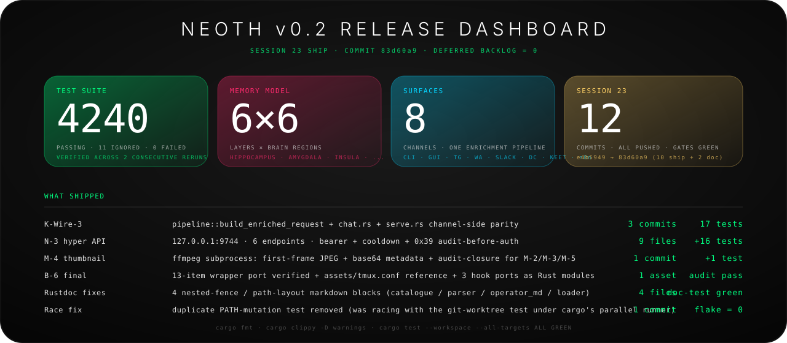

<!--
  NEOTH README - public v1.1 release narrative.
  Written for the intended public 1.0/1.1 release surface, not for an
  intermediate private build snapshot.
-->

<div align="center">


<br>

<h1>Stop reintroducing yourself to your AI.</h1>

<p>
  <strong>Daily companion for humans. Operator memory for pros. Local-first by default.</strong>
</p>

<p>
  It remembers what you allow, works in your interests, follows you across your tools,
  and gives serious operators a Rust-powered local stack without making normal people edit YAML.
</p>

<p>
  <strong>One memory. Every surface. Your rules.</strong>
</p>

<p>
  <a href="#try-it-in-60-seconds"><strong>Try it</strong></a>
  -
  <a href="#why-neoth">Why NEOTH</a>
  -
  <a href="#coding-buddy">Coding Buddy</a>
  -
  <a href="#neoth-vs-hermes-vs-openhuman-vs-openclaw">Comparison</a>
  -
  <a href="#privacy-you-can-verify">Privacy</a>
  -
  <a href="#the-engine">Engine</a>
  -
  <a href="#install">Install</a>
</p>

<p>
  <a href="https://github.com/The-Geek-Freaks/NEOTH/actions">
    
  </a>
  <a href="https://www.rust-lang.org">
    
  </a>
  <a href="#privacy-you-can-verify">
    
  </a>
  <a href="#install">
    
  </a>
  <a href="#license">
    
  </a>
</p>

<p>
  
  
  
  
  
  
  
</p>

</div>

## What's new in v0.2 (Session 23 ship)



Frisch geshipped — public release candidate aus commit `83d60a9`:

| Workstream | Ship | Why it matters |
| :-- | :-- | :-- |
| **K — pipeline helper** | `pipeline::build_enriched_request` factored out + channel-side parity | Telegram / Slack / Keet inbounds now layer operator_md + skills + MCP catalogue + persona prefix the same way `neoth chat` does — channels stop being second-class. |
| **D — n8n localhost API** | Hyper 1.x server on `127.0.0.1:9744`, 6 endpoints, bearer auth, 5-strike cooldown, 0x39 WAL audit per request | n8n workflows can now drive NEOTH (recall, provider call, memory save, channel send) without any cloud round-trip. Loopback-only + audit-before-auth means every attempt is durable, every misuse is visible. |
| **H — multimodal pipeline** | Video thumbnail extract via ffmpeg subprocess + 4-backend chain (pdf / vision / audio / video) verified end-to-end | Voice messages in Telegram → 16 kHz mono → operator-cached Whisper → chat reply. Images → CLIP embeddings → cosine-similarity recall. Videos → audio track + JPEG thumbnail in one ffmpeg pass. |
| **I — claude-cli tmux backend** | 13-item wrapper-port audit closure + `assets/tmux.conf` reference snippet | Warm-session protocol (dual-timer wait, idle/working detection, v6.4.3 bullet-line extractor, 4-class retry, ANSI strip, `--append-system-prompt` conflict merge) all in-process. No bridge.py dependency. |

Plus: 4 Rustdoc nested-fence fixes + test-suite race fix (process-wide PATH mutation race against the worktree test).

**v0.2 deferred backlog: 0.** All 8 items from the Session 23 handoff closed. v0.2.0 tag-ready from HEAD.

## Try it in 60 seconds

Guided setup for normal users:

```bash
cargo install neoth
neoth gui
```

Terminal setup for builders:

```bash
cargo install neoth
neoth init
neoth chat "Remember that I prefer short answers and work mostly in Rust."
neoth recall "what do you know about how I like to work?"
```

> **Windows from source:** NEOTH requires the MSVC toolchain
> (`x86_64-pc-windows-msvc`), NOT the GNU/MinGW default. The
> `inventory` crate's plugin-hook registration uses `#[link_section]`
> attributes that GNU `ld` garbage-collects without `--whole-archive`,
> so a GNU build compiles cleanly but loads zero plugins at runtime
> (silently). The shipped `scripts/cargo-msvc.ps1` wrapper sets the
> right environment automatically; CI also fails MSVC-less Windows
> jobs explicitly (ADV-11).

The wizard asks human questions: who you are, where NEOTH should talk to you, which privacy defaults you want, which model should answer quickly, which local model may learn your profile, and how much autonomy it gets.

YAML is optional. The engine is not.

### Self-dev — NEOTH proposes its own profile adjustments

NEOTH watches how you actually use it (5 behavioural signals: temporal,
cadence, length, topic, tone) and proposes profile adjustments you can
accept or decline. Every proposal lands in your operator-visible local
store + emits a WAL frame so the decision chain is auditable.

```bash
# (NEOTH writes a behavioural-profile snapshot as the cron aggregation
#  task runs; for a one-off you can hand-craft one or pipe it from a
#  future `neoth profile stats` command.)

neoth self-dev propose --from-profile ~/.neoth/profile_snapshot.json
neoth self-dev review                         # list pending proposals
neoth self-dev accept switch_preset-a1b2c3d4  # emits 0x1D WAL frame
neoth self-dev decline switch_preset-deadbeef --reason timeout
```

What it can propose today:

- **Switch preset** when tone signal flipped vs the active preset.
- **Adjust verbosity** when median prompt length crosses 30 / 200 chars.
- **Adjust briefing schedule** when peak hour drifts.
- **Learn extension** when a topic crosses 30 prompts.

Every accept/decline is recorded as `EVENT_TYPE_SELF_DEV_ACCEPTED` (0x1D)
or `EVENT_TYPE_SELF_DEV_DECLINED` (0x1E) in the WAL — you can audit
NEOTH's self-improvement chain with `neoth wal show --type self_dev_*`.


<table>
  <tr>
    <td width="33%">
      <strong>Normal-user friendly</strong><br>
      Wizard-first onboarding, plain-language defaults, chat-app setup, and privacy controls without config-file archaeology.
    </td>
    <td width="33%">
      <strong>Pro-grade underneath</strong><br>
      Rust core, optional Slint GUI, WAL-backed memory, local models, provider routing, plugins, audits, and cluster pairing.
    </td>
    <td width="33%">
      <strong>One loyal buddy</strong><br>
      Same memory across desktop, terminal, phone, team chat, Obsidian, private mesh, and coding sessions.
    </td>
  </tr>
</table>

<br>


<br>


<br>

# Why NEOTH

### Your AI should be on your side.

Most assistants are brilliant strangers. They answer one prompt, vanish, and make you rebuild context from zero.

NEOTH is built around **continuity and loyalty**. It learns your preferences, projects, routines, people, tools, infrastructure, decisions, and coding style, but only inside boundaries you control.

It is not here to harvest you, lock you in, or maximize engagement. It is here to help the operator: **you**.

Think private-Jarvis energy without black-box lock-in: context-aware, loyal to the operator, present wherever you work, and built as inspectable local-first software.

> A chatbot impresses you once. A buddy gets useful over months.

### The loyalty contract

| Promise | What it means |
| :-- | :-- |
| **It works for you** | Your interests, constraints, language, tools, and goals shape the answer. Not vendor defaults. |
| **It remembers with permission** | Long-term memory is explicit, inspectable, redactable, pauseable, and tied to evidence. |
| **It follows your context** | CLI, GUI, Telegram, WhatsApp, Slack, Discord, Keet, Obsidian, and coding sessions can share the same buddy. |
| **It keeps private learning local** | Profile extraction runs on your machine by default through local Qwen/Ouro. No silent cloud fallback. |
| **It shows its work** | Audit what it knows, where requests went, which profile facts mattered, and what plugins were allowed to do. |
| **It scales from simple to serious** | Plain-language wizard for normal users. WAL, council, plugins, cluster, and policy gates for pros. |

### What this feels like in real life

| Moment | Without NEOTH | With NEOTH |
| :-- | :-- | :-- |
| You start a new chat | You explain yourself again. | NEOTH already knows your style, tools, active projects, and constraints. |
| You switch from laptop to phone | Context splits across apps. | Same buddy through GUI, CLI, phone channels, and team chat. |
| You forget a past decision | You search old chats manually. | Ask NEOTH what you decided and why. |
| You change your mind | Old assumptions linger. | Redact, correct, pause, or re-learn profile facts. |
| You ask something high-impact | One model may bluff confidently. | NEOTH can trigger a council and surface disagreement. |
| You want privacy proof | You trust a black box. | Run `neoth privacy audit` and inspect destinations, evidence, memory, and plugin capabilities. |

### What makes it different

NEOTH is one buddy with many doors: the same memory, permissions, and redactions follow the operator across tools.


<table>
  <tr>
    <td width="33%">
      <strong>Memory that survives sessions</strong><br>
      Decisions, preferences, people, projects, infrastructure, and recurring patterns stop disappearing.
    </td>
    <td width="33%">
      <strong>One buddy across surfaces</strong><br>
      Same profile across CLI, GUI, Telegram, WhatsApp, Slack, Discord, Keet, Obsidian, and cluster devices.
    </td>
    <td width="33%">
      <strong>Local profile extraction</strong><br>
      Qwen/Ouro can learn profile facts locally instead of shipping your private memory to a second vendor.
    </td>
  </tr>
  <tr>
    <td width="33%">
      <strong>Coding buddy mode</strong><br>
      Planning canvas, Kanban board, dispatch, review promotion, and durable repo memory for long coding work.
    </td>
    <td width="33%">
      <strong>Three role-bound hemispheres</strong><br>
      Fast implementation, deep analysis, and synthesis talk to each other instead of forcing one model to bluff alone.
    </td>
    <td width="33%">
      <strong>Auditable trust</strong><br>
      Evidence, redactions, destination audit, WAL verification, policy gates, and sandboxed plugins.
    </td>
  </tr>
</table>

### Choose your path

| If you are... | Start here | You get |
| :-- | :-- | :-- |
| **A normal user** | `neoth gui` | Guided setup, plain-language defaults, chat-app connection, memory controls, and no YAML requirement. |
| **A builder** | `neoth init` + CLI | Recall, provider routing, local models, plugins, coding sessions, scripted workflows, and project memory. |
| **A privacy hardliner** | `neoth privacy audit` | Local-first learning, request destination logs, redactions, no silent fallback, and inspectable memory. |

### Built for the second month, not the first prompt

NEOTH is designed for the point where normal assistants become annoying:

- the tenth time you explain your working style,
- the third device where your context disappears,
- the old decision you cannot find,
- the plugin you do not fully trust,
- the private detail you want remembered but not uploaded,
- the hard question where one model should not get the final word.

That is the product: continuity, control, and help that compounds.

<br>


<br>


<br>

# The Buddy

### Start simple. Grow into power when you need it.

Prefer the guided setup?

```bash
cargo install neoth
neoth gui
```

Prefer the terminal?

```bash
cargo install neoth
neoth init
neoth chat "Remember that I prefer short answers and work mostly in Rust."
neoth recall "what do you know about how I like to work?"
```

The GUI walks you through identity, provider choice, local models, autonomy level, channels, privacy defaults, and buddy discovery. The terminal wizard mirrors the same flow for SSH and server installs.

### What the first run feels like

```text
$ neoth init

NEOTH
Your Buddy, Your Life

1. Who are you?
2. Where should NEOTH talk to you?
3. Which model should answer quickly?
4. Which local model should learn your profile?
5. How autonomous may it be?
6. Should your other NEOTH devices find this one?

Done. Say hello:

$ neoth chat "hello"
Neoth: I'm here. What should I remember first?
```

### For normal users

You do not need to understand models, daemons, WALs, embeddings, routing, or plugins.

1. Install NEOTH.
2. Open the wizard.
3. Pick local-first defaults if you are unsure.
4. Connect Telegram, WhatsApp, Slack, Discord, or Keet.
5. Talk to NEOTH like a person.
6. Use `neoth privacy audit` whenever you want to see what it knows and where requests went.

### For pros

Under the buddy surface is a serious operator stack.

```bash
neoth status
neoth doctor
neoth model fetch qwen
neoth model fetch ouro-1.4b-thinking
neoth ingest ~/Downloads/meeting.mp3
neoth recall "the router issue from last month" --since 90d
neoth privacy audit --last 30d
neoth cluster discover
neoth code "add a migration and tests for the profile baseline event" --dispatch
```

## Coding Buddy

NEOTH is not another chat UI. It is a local-first operator layer with WAL-backed memory, six brain-region views, three role-bound hemispheres, audited profile learning, and consent-gated clustering on LAN and Tailscale today (Hysteria sidecar pattern for restricted networks; embedded path lands post-O-7).

For coding, it can sit next to your repo, remember the project, plan work on a canvas, split tasks into a Kanban board, dispatch focused coding sessions, and keep review context from disappearing between runs.


```bash
neoth code "add a migration and tests for the profile baseline event" --dispatch
neoth kanban watch
neoth recall "why did we choose the WAL profile schema?"
```

| Workflow | What NEOTH does |
| :-- | :-- |
| **Plan** | Turns a prompt into scoped tasks, dependencies, acceptance criteria, and a reviewable coding canvas. |
| **Dispatch** | Sends small, obvious tasks to the fast role and ambiguous architecture or review work to the deep role. |
| **Track** | Keeps Backlog, Todo, In Progress, Review, Done, Blocked, and Archived visible in GUI and CLI Kanban views. |
| **Implement** | Works against repo context, remembered decisions, provider routing, and local/project constraints. |
| **Review** | Promotes findings, dissent, tests, and design decisions into durable memory instead of losing them in chat. |
| **Resume** | Recalls prior bugs, migrations, tradeoffs, and open threads without making you re-explain the repo. |

Hermes proved the Kanban-shaped coding loop; NEOTH makes it native to memory. The point is not "AI writes code once". The point is a coding buddy that remembers the project, coordinates its own roles, improves its plans, and gives the operator a visible control surface.

### The daily loop

| Moment | NEOTH behavior |
| :-- | :-- |
| You mention a preference | It can become a profile claim with evidence, confidence, and redaction controls. |
| You ask about old context | It recalls episodes, profile facts, files, images, audio, and prior decisions. |
| You ask something hard | It can route through a council instead of forcing one model to bluff alone. |
| You connect a new device | Cluster discovery can pair it into your memory mesh after consent. |
| You install a plugin | WASM permissions, memory caps, fuel limits, and hostcall allowlists contain it. |
| You finish a coding session | NEOTH can remember the decision, test outcome, review finding, and follow-up task. |

## NEOTH vs Hermes vs OpenHuman vs OpenClaw

Different projects optimize for different jobs. NEOTH is the one shaped around a **loyal, private, long-term buddy** that also has serious engineering depth.

### 7 things only NEOTH does

> The other projects each get one of these right. NEOTH is the only one that ships **all of them in the same binary**.

| # | Capability | Why it's unique |
| :--: | :-- | :-- |
| 1 | **Layered enrichment helper used by BOTH CLI + channels** (`pipeline::build_enriched_request`) | Channel inbounds (Telegram / Slack / Keet) get the same operator_md + skills + MCP catalogue + persona prefix the CLI does. Other tools treat channels as second-class one-shot prompts. |
| 2 | **n8n localhost API with WAL audit-before-auth** (`/api/{health,recall,provider/call,channel/send,stats,memory/save}` on `127.0.0.1:9744`) | Workflow automation drives NEOTH without any cloud round-trip; every request lands in the WAL **before** the auth check so even refused attempts are durable. |
| 3 | **Local profile extraction with no silent cloud fallback** (Qwen / Ouro forward pass behind `inference.embedding_provider` + L-07 `allow_cloud_fallback: false` safe-default) | When the local model isn't cached, the embedding hop returns `None` instead of leaking the prompt to a vendor. Other tools default the other way. |
| 4 | **Six brain-region SQLite views** (`idx_episode` / `idx_importance` / `idx_council` / `idx_motor` / `idx_habit` / `idx_profile`) | Recall isn't one flat "history" — it's hippocampus + amygdala + insula + cerebellum + basal-ganglia + hypothalamus, each tracked separately + queryable independently. |
| 5 | **Three role-bound hemispheres with smart-trigger council** (Left fast + Right deep + Cerebellum orchestrator, dissent surfaced as `EVENT_TYPE_COUNCIL_*` WAL frames) | Daily budget + per-day debate cap mean the council only fires when complexity / risk / contradiction warrants it. Other multi-agent stacks debate everything. |
| 6 | **Operator-cached multimodal pipeline** (image / audio / video → local CLIP / Whisper / ffmpeg, transcription metadata surfaces cache status) | Phone-home is never the fallback. If artifacts aren't cached, metadata says `"model not cached"` and the chat sees the actionable next step. |
| 7 | **Tmux warm-session claude-cli backend in-process** (full bridge.py v6.4.3 protocol: dual-timer wait, bullet-line extractor, 4-class retry, --append-system-prompt merge, env scrub, opusplan alias) | No external bridge daemon. The "claude takes 30s to wake up" cold-start problem disappears via a warm tmux pane the adapter owns + sweeps via the B-10 TTL task. |

<br>


Legend: `&#10003;` strong / native, `&#9680;` partial / adjacent, `&#8722;` not the focus in local sources, `preview` exists but should not be oversold.

| Capability | NEOTH | Hermes | OpenHuman | OpenClaw |
| :-- | :--: | :--: | :--: | :--: |
| Daily buddy for normal users **and** pro operators | &#10003; loyal DAU + operator stack | &#9680; workflow-agent first | &#9680; desktop-assistant first | &#9680; gateway first |
| Loyalty/privacy contract: permissioned memory, redaction, auditability | &#10003; | &#9680; self-hosted memory | &#9680; local memory + backend-brokered integrations | &#9680; gateway allowlists/security knobs |
| Local profile extraction with no silent cloud fallback | &#10003; Qwen/Ouro path | &#9680; profile/memory files | &#9680; profile learning + local Memory Tree | &#9680; memory/plugin-adjacent |
| Three role-bound hemispheres plus council/dissent | &#10003; | &#9680; agent orchestration | &#8722; | &#9680; multi-agent routing |
| Six memory layers plus six brain-region views | &#10003; | &#9680; persistent/layered memory | &#9680; Memory Tree | &#9680; memory plugin/context surface |
| Coding canvas + Kanban + dispatch + review promotion tied to memory | &#10003; | &#10003; Kanban/workflow precedent | &#9680; coder tools | &#9680; Live Canvas + agents |
| Obsidian / human-inspectable memory | &#10003; WAL authoritative, vault inspectable | &#9680; Markdown memory files | &#10003; strongest Obsidian/Memory Tree UX | &#9680; wiki/skill bridge |
| Private mesh/channel story: LAN/mDNS, Tailscale, Hysteria, Keet | &#9680; LAN/mDNS shipped; Tailscale shipped; Hysteria sidecar-ready (relay binary + config types + health checks); Keet adapter scaffolded (R-A1 gated) | &#9680; Tailscale access | &#8722; | &#9680; Bonjour/Tailscale nodes |
| Consent-gated memory cluster semantics | &#9680; explicit architecture/primitives | &#8722; | &#8722; | &#9680; gateway/node pairing |
| Deployment shape | &#10003; Rust core + optional Rust/Slint GUI | &#8722; Python/web/Docker style | &#9680; Tauri + Rust sidecar + pnpm app | &#8722; Node/TypeScript gateway |
| Plugin sandbox | &#10003; WASM caps + hostcall allowlist | &#9680; skills/extensions | &#10003; QuickJS skill sandbox | &#10003; Docker/SSH/OpenShell sandbox + plugin API |
| n8n / workflow HTTP API on loopback with WAL audit-per-request | &#10003; `/api/*` on 127.0.0.1:9744, bearer + cooldown + 0x39 audit | &#8722; | &#8722; | &#9680; gateway HTTP surface (not n8n-shaped) |
| Channel-side enrichment parity with the CLI prompt path | &#10003; `pipeline::build_enriched_request` reused by `chat.rs` + `serve.rs` (Session 23 K-Wire-3) | &#8722; | &#8722; | &#9680; gateway message pipeline |
| Mode router on top of skill router (narrower trigger-phrases beat broad keywords) | &#10003; `ModeRegistry::match_trigger` overlays `system_prompt_delta` | &#9680; skill activation | &#8722; | &#9680; agent/skill match |
| Two-stage skill router (keyword Stage-1 + embedding cosine Stage-2) | &#10003; `route_stage2_embedding` runs only when Stage-1 misses + `inference.embedding_provider` is wired | &#8722; | &#9680; embedding-search adjacent | &#8722; |
| Operator-cached multimodal pipeline (CLIP image embeddings + Whisper transcript + ffmpeg thumbnail / audio extract) | &#10003; all 4 extractors in-process; cache-miss surfaces `transcription_status: "model not cached"` | &#8722; | &#9680; ingestion-adjacent | &#9680; channel attachments |
| Warm-session tmux backend for `claude-cli` (no cold start, full bridge.py v6.4.3 protocol in-process) | &#10003; `claude_tmux::send_and_wait` + 4-class retry + bullet-line extractor + 8 tmux options + B-10 TTL sweeper | &#9680; CLI-tool wrappers | &#8722; | &#9680; claude-cli adapter |
| WAL frame band reservations + bounded body caps | &#10003; 0x01..=0x7F structured; n8n API capped at 256 KiB | &#9680; structured logs | &#9680; episode log | &#9680; audit log |

Short version: Hermes is the Kanban/workflow precedent, OpenHuman is the Obsidian/auto-fetch precedent, and OpenClaw is the gateway/channel/canvas precedent. NEOTH's defensible advantage is the combination: loyal DAU-friendly buddy positioning, local profile learning with audit/redaction, three-hemisphere council, brain-region memory model, native coding workflow, and cluster-ready private mesh (LAN/Tailscale today, Hysteria sidecar pattern ready, Keet adapter gated on R-A1) in a Rust-first operator runtime.

<br>


<br>


<br>

# The Engine

### The machinery that makes the buddy trustworthy.


### Three role-bound hemispheres that talk to each other

NEOTH is built like a small operator brain, not a one-model prompt pipe. The roles share memory, pass evidence, disagree when needed, and leave traces the operator can inspect.

| Cognitive role | Job | Why it matters |
| :-- | :-- | :-- |
| **Left Hemisphere** | Fast replies, implementation, small fixes, routine execution. | Keeps normal help responsive and coding loops cheap. |
| **Right Hemisphere** | Deep analysis, architecture, review, risk spotting, pattern synthesis. | Handles the work where one shallow answer is not enough. |
| **Corpus Callosum / Cerebellum** | Message passing, orchestration, dissent, tool outcomes, Kanban state, provider routing. | Makes the halves coordinate instead of becoming disconnected agents. |

### The six memory layers

The v1.1 memory model is designed for continuity without dumping everything into one opaque chat history.

| Layer | Job | Example |
| :-- | :-- | :-- |
| **L1 Hot working set** | Current session, active canvas, active task state. | "We are editing the README and comparing NEOTH to Hermes/OpenHuman/OpenClaw." |
| **L2 Warm cache** | Recent recall, high-use facts, short-term project context. | "User prefers direct answers and is actively building NEOTH." |
| **L3 Episodic memory** | Conversations, events, timelines, decisions. | "Why did we choose local profile extraction?" |
| **L4 Semantic memory** | Embeddings, concepts, files, images, audio, video, related knowledge. | "Find the router issue, even if I do not remember the exact words." |
| **L5 Knowledge and skills** | Lessons, routines, skill packs, tool success, provider habits. | "Use this review checklist when touching memory code." |
| **L6 Obsidian / vault mirror** | Human-readable long-term archive and operator-owned knowledge base. | "Sync this decision into the vault so I can inspect it outside NEOTH." |

### The six memory regions


| Region | View | Purpose |
| :-- | :-- | :-- |
| Hippocampus | `idx_episode` | Conversations, events, and time-anchored recall. |
| Amygdala | `idx_importance` | Salience, urgency, and priority signals. |
| Insula | `idx_council` | Debate logs, dissent, and verdict traces. |
| Cerebellum | `idx_motor` | Provider quotas, rate limits, tool outcomes, execution state. |
| Basal Ganglia | `idx_habit` | Repeated patterns, skills, triggers, routines. |
| Hypothalamus | `idx_profile` | Long-term operator profile, evidence, redactions. |

### Feature map

| Area | v1.1 release behavior |
| :-- | :-- |
| **Install** | Single Rust binary plus optional Slint GUI. No Docker stack required. |
| **Onboarding** | CLI wizard and GUI wizard with plain-language defaults. |
| **Channels** | CLI, GUI, Telegram, WhatsApp Business, Slack Socket Mode, Discord, Keet. |
| **Memory** | WAL-backed long-term memory, profile claims, multimodal recall, redaction registry. |
| **Models** | Claude, OpenAI, Gemini, OpenAI-compatible, local Qwen, local Ouro thinking models. |
| **Council** | Smart trigger, daily budget, dissent surfacing, provider role binding. |
| **Local inference** | Qwen for profile extraction; Ouro as optional thinking/reasoning provider. |
| **Multimodal** | PDF, image, audio, and video ingestion with local embeddings/transcription paths. |
| **Coding** | `neoth code --dispatch`, Kanban sessions, sub-agent roles, review promotion. |
| **Plugins** | Skills as data, plugins as code, WASM runtime with resource limits. |
| **Cluster** | Single-node `OrchestratingPolicy` + WAL events ship today; multi-peer routing rides on the Keet transport (R-A1 gated). LAN/mDNS pairing primitives ready. |
| **Hysteria** | Sidecar pattern. NEOTH ships the relay binary + config types + health checks; the Hysteria QUIC daemon runs as a separate process today. Embedded build deferred to post-O-7. |
| **Ops** | `doctor`, `status`, `privacy audit`, `wal verify`, backup, self-update, release signing. |

### Release surface

| Surface | v1.1 public release line |
| :-- | :-- |
| Core channels | CLI, GUI, Telegram, WhatsApp Business, Slack Socket Mode. |
| Extended channels | Discord and Keet, exposed behind the same channel adapter contract. |
| Local model choices | Qwen as default local memory model; Ouro as optional thinking model. |
| Cluster | LAN/mDNS pairing + Tailscale shipped. Hysteria relay is sidecar-ready (separate Hysteria QUIC daemon today; embedded build follows post-O-7). |
| Cloud | Explicit provider choice only. No silent profile-extraction fallback. |

### Why the council matters

NEOTH does not ask every model every time. That is expensive and slow.

Instead, the council triggers when a message is complex, risky, contradictory, high-impact, or operator-configured. The fast model handles normal chat. The deep role watches patterns. The synthesis role exposes disagreement before it turns into confident nonsense.

```toml
[council.budget]
max_debates_per_day = 5
max_usd_per_day = 2.00
trigger = "smart"
```

### Privacy you can verify

NEOTH treats the operator as the customer, not the data source.

- It does not silently create new network surfaces.
- It does not silently fall back to cloud profile extraction.
- It does not hide memory behind vendor history.
- It does not relearn redacted facts unless you allow relearning.
- It does not require YAML for the happy path.
- It does not make plugins ambiently powerful.

> Private does not mean "trust us". Private means you can check.

| Data | Default |
| :-- | :-- |
| Raw conversation memory | Local WAL. |
| Profile extraction | Local Qwen/Ouro. |
| Cloud fallback for extraction | Off unless you explicitly enable it. |
| Provider requests | Audited by destination. |
| Redacted profile facts | Blocked from recreation unless you allow relearning. |
| Plugin capabilities | Declared, capped, and audited. |
| New network surfaces | Must pass explicit no-phone-home invariants. |

Run:

```bash
neoth privacy audit --last 30d
neoth profile show --evidence
neoth profile redact identity.location
neoth wal verify
```

### Local models

| Model | Role | Why it exists |
| :-- | :-- | :-- |
| Qwen | Local profile extraction and embeddings | Private, bilingual, cheap, good enough for continuous learning. |
| Ouro | Local thinking/reasoning alternative | Looped transformer reasoning without sending the prompt to a cloud API. |
| CLIP | Image embeddings | Cross-modal recall for images and visual files. |
| Whisper | Audio transcription | Voice notes, meetings, and video audio tracks. |

```bash
neoth model list
neoth model fetch qwen
neoth model fetch ouro-1.4b-thinking
neoth model fetch clip
neoth model fetch whisper
```

### Plugins without giving them the keys to your life

NEOTH has two extension surfaces:

| Surface | Best for | Safety model |
| :-- | :-- | :-- |
| Skills | Context, instructions, templates, domain knowledge | Data-only, hot-reloadable, no code execution. |
| WASM plugins | Real logic at lifecycle hooks | Fuel limit, 64 MiB memory cap, timeout, hostcall allowlist, no ambient filesystem/network. |

```text
~/.neoth/plugins/my-plugin/
  plugin.toml
  my-plugin.wasm
```

### Obsidian and private mesh

NEOTH should fit into the knowledge system and network you already trust, not force everything into one app.


| Surface | What it is for |
| :-- | :-- |
| **Obsidian vault** | Human-readable memory mirror, project notes, decisions, skills, and long-term knowledge you can inspect without NEOTH. |
| **LAN / mDNS** | Home and office devices. |
| **Tailscale / WireGuard** | Private device mesh for laptop, workstation, home server, and travel machines. |
| **Hysteria sidecar** | Sidecar-ready integration. NEOTH ships the relay binary + config types + health checks; the Hysteria QUIC daemon itself runs alongside as a separate process per the architect's verdict. Embedded build lands post-O-7. |
| **Keet** | Peer-to-peer chat/channel path for users who want less platform gravity. Adapter currently scaffolded; full transport gated on the operator's Hyperswarm-path decision (R-A1). |
| **Cluster pairing** | Cluster-ready NEOTH nodes. Single-node mode + the `OrchestratingPolicy` trait + WAL events ship today; live multi-peer routing rides on top of the Keet transport once R-A1 lands. |

Pairing is consent-gated. A peer with the right key still needs approval before it joins your memory cluster.

```bash
neoth cluster discover
neoth cluster confirm <peer>
neoth cluster status
```

### Self-improvement without self-betrayal

Self-improvement is evidence-based, not magical. NEOTH can improve how it helps without turning into an unbounded black box.

| Learns from | Becomes better at | Boundary |
| :-- | :-- | :-- |
| Tool outcomes | Choosing the right tool/provider next time. | Auditable traces and policy gates. |
| Coding sessions | Better task splits, review focus, test selection, and project recall. | Operator-visible Kanban and review promotion. |
| Profile corrections | Matching your tone, constraints, priorities, and preferences. | Evidence, redaction, pause, and relearn controls. |
| Skill usage | Loading the right domain knowledge at the right time. | Skills are data; plugins have explicit capabilities. |
| Council dissent | Avoiding repeated bad assumptions and shallow answers. | Debates are budgeted and inspectable. |

### Compared to normal assistants

| Normal assistant | NEOTH |
| :-- | :-- |
| Starts over every session. | Builds continuity across weeks and months. |
| Lives in one vendor app. | Follows you across CLI, GUI, chat apps, Obsidian, and devices. |
| Has opaque memory. | Shows profile facts, evidence, confidence, and redactions. |
| Optimizes for provider defaults. | Adapts to your language, role, tone, tools, and constraints. |
| Sends more than you can see. | Audits where requests went and keeps profile extraction local by default. |
| Is easy or powerful, rarely both. | Wizard-first for normal users, deep internals for pros. |

<br>


<br>

## Install

For the public release:

```bash
cargo install neoth
```

From source:

```bash
git clone https://github.com/The-Geek-Freaks/NEOTH
cd NEOTH/SRC
cargo install --path neothd
cargo install --path neothd-gui
```

Linux/macOS no-sudo installer:

```bash
curl -fsSL https://raw.githubusercontent.com/The-Geek-Freaks/NEOTH/main/scripts/install.sh | bash
```

Windows:

```powershell
irm https://raw.githubusercontent.com/The-Geek-Freaks/NEOTH/main/scripts/install.ps1 | iex
```

Requirements:

| Requirement | Why |
| :-- | :-- |
| Rust 1.86+ | Source builds and cargo install. |
| 2 GB free disk | WAL, SQLite views, basic cache. |
| 4 GB+ VRAM recommended | Local Qwen/Ouro path. CPU fallback works slower. |
| One provider or local model | Claude/OpenAI/Gemini-compatible or Qwen/Ouro. |

### Common commands

```bash
neoth init
neoth gui
neoth chat "what should I focus on today?"
neoth recall "the build failure from Tuesday"
neoth status
neoth doctor
neoth privacy audit
neoth model list
neoth plugin list
neoth cluster status
neoth code "plan the next migration" --dispatch
neoth kanban watch
neoth profile show --evidence
```

## Docs

| File | Purpose |
| :-- | :-- |
| [docs/getting-started.md](docs/getting-started.md) | First run, first chat, first channel. |
| [docs/install.md](docs/install.md) | Platform-specific install notes. |
| [docs/cli-reference.md](docs/cli-reference.md) | Every command. |
| [docs/configuration.md](docs/configuration.md) | `freedom.yaml`, credentials, policy. |
| [docs/providers.md](docs/providers.md) | Claude, OpenAI, Gemini, local models. |
| [docs/channels.md](docs/channels.md) | Telegram, WhatsApp, Slack, Discord, Keet. |
| [docs/local-models.md](docs/local-models.md) | Qwen, Ouro, CLIP, Whisper. |
| [docs/plugins.md](docs/plugins.md) | Skills and WASM plugins. |
| [docs/council.md](docs/council.md) | Multi-model council design. |
| [docs/cron-vs-n8n.md](docs/cron-vs-n8n.md) | When to use the built-in cron vs the n8n localhost API. |
| [docs/n8n-api.md](docs/n8n-api.md) | Loopback HTTP API: endpoints, bearer auth, audit trail, curl examples. |
| [docs/troubleshooting.md](docs/troubleshooting.md) | Fix common setup problems. |

### Design sources

The public release line follows the v1.1 design:

| File | Why it matters |
| :-- | :-- |
| [PLAN/00_DESIGN_v1.1_FINAL.md](PLAN/00_DESIGN_v1.1_FINAL.md) | Normative architecture. |
| [PLAN/SPEC_local_inference.md](PLAN/SPEC_local_inference.md) | Local Qwen privacy fix. |
| [PLAN/SPEC_ouro_thinking_provider_2026-05-23.md](PLAN/SPEC_ouro_thinking_provider_2026-05-23.md) | Ouro provider path. |
| [PLAN/SPEC_coding_workflow.md](PLAN/SPEC_coding_workflow.md) | Coding canvas, Kanban, dispatch, and review loop. |
| [PLAN/SPEC_skill_plugin_system.md](PLAN/SPEC_skill_plugin_system.md) | Skills, plugins, capability boundaries. |
| [PLAN/CHANNELS_SPEC_2026-05-20.md](PLAN/CHANNELS_SPEC_2026-05-20.md) | Telegram, WhatsApp, Slack, Discord, and Keet channel plan. |
| [PLAN/SPEC_cluster_auto_discovery_2026-05-22.md](PLAN/SPEC_cluster_auto_discovery_2026-05-22.md) | Cluster discovery and pairing. |

## Contributing

NEOTH is strict because the memory surface is sensitive.

```bash
cd SRC
cargo fmt --all
cargo clippy --workspace --tests -- -D warnings
cargo test --workspace
```

Rules:

| Rule | Reason |
| :-- | :-- |
| No silent network surfaces | "Never phones home" must stay mechanically testable. |
| No unbounded plugin power | Every hostcall needs a declared capability. |
| No vague memory writes | Profile claims need evidence and redaction semantics. |
| No hostile setup | If a user must edit YAML for the happy path, the UX failed. |

See [CONTRIBUTING.md](CONTRIBUTING.md), [CODE_OF_CONDUCT.md](CODE_OF_CONDUCT.md), and [SECURITY.md](SECURITY.md).

## License

Licensed under either:

- MIT License ([LICENSE-MIT](LICENSE-MIT))
- Apache License, Version 2.0 ([LICENSE-APACHE](LICENSE-APACHE))

at your option.

<br>


<br>

<div align="center">


<br>

<strong>Stop reintroducing yourself to your AI.</strong>

<br><br>

<code>cargo install neoth && neoth gui</code>

<br><br>

<sub>NEOTH - Neural Engine Obligated To Help - v1.1 Sovereign Buddy</sub>

</div>
