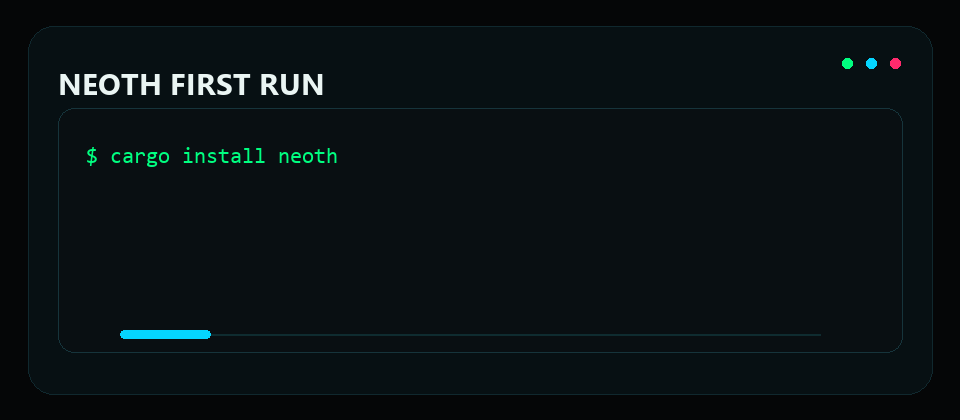
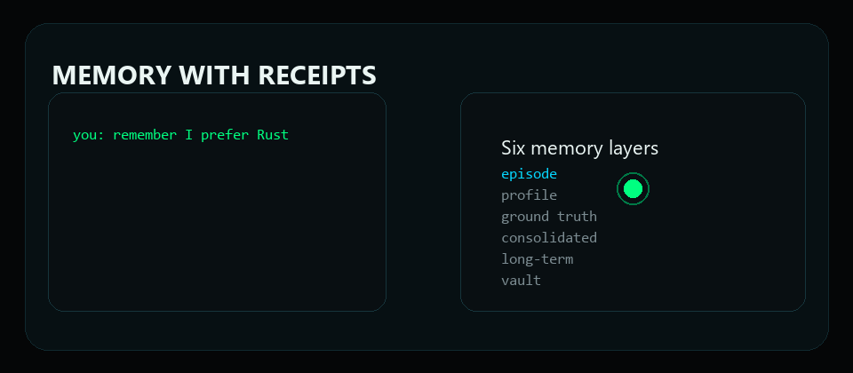
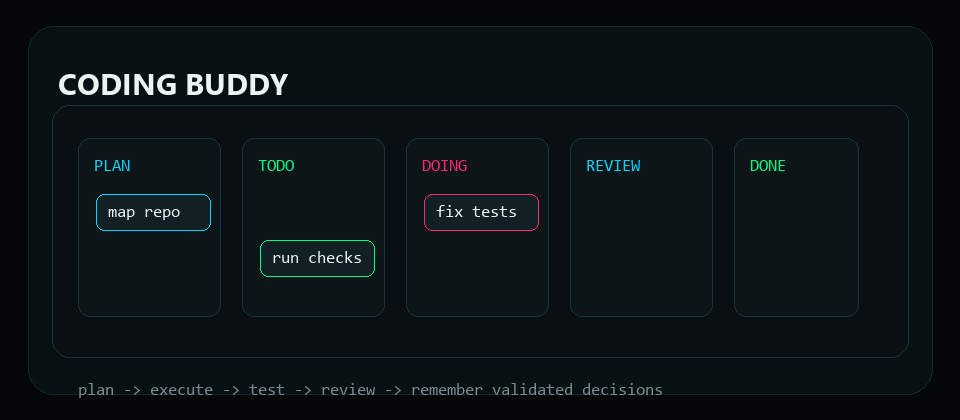
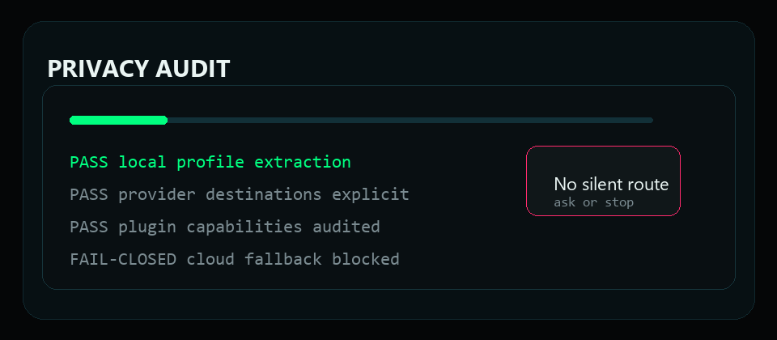

<div align="center">


<h1>NEOTH</h1>

<h3>Your private AI buddy. Loyal to you. Useful everywhere.</h3>

<p>
  <strong>One memory. Three brain paths. Six memory layers. Local-first by default.</strong>
</p>

<p>
  NEOTH is the personal AI system for people who want a real assistant, not a
  forgetful chatbot. It remembers what you approve, helps in daily life, codes
  seriously, connects to your tools, runs on your own machine, and leaves proof
  for every sensitive decision.
</p>

<p>
  <a href="#install"><strong>Install</strong></a>
  · <a href="#why-neoth">Why NEOTH</a>
  · <a href="#demo-loops">Demos</a>
  · <a href="#for-normal-users-and-pros">DAUs + Pros</a>
  · <a href="#privacy">Privacy</a>
  · <a href="#coding-buddy">Coding</a>
  · <a href="#comparison">Comparison</a>
  · <a href="#docs">Docs</a>
</p>

<p>
  <a href="https://github.com/The-Geek-Freaks/NEOTH/actions">
    
  </a>
  <a href="#privacy">
    
  </a>
  <a href="#coding-buddy">
    
  </a>
  <a href="#privacy">
    
  </a>
  <a href="#license">
    
  </a>
</p>

</div>

## Install

> NEOTH is pre-1.0 (current crate version `0.2.1`, building toward the 1.0 target
> below). It is **not yet published to crates.io**, so install from source or the
> bootstrap script — `cargo install neoth` will land with the 1.0 release.

One-command install (Linux/macOS):

```bash
curl -fsSL https://raw.githubusercontent.com/The-Geek-Freaks/NEOTH/main/SRC/install.sh | bash
neoth gui
```

Windows (PowerShell):

```powershell
irm https://raw.githubusercontent.com/The-Geek-Freaks/NEOTH/main/SRC/install.ps1 | iex
neoth gui
```

From source:

```bash
git clone https://github.com/The-Geek-Freaks/NEOTH
cd NEOTH/SRC
cargo install --path neothd
cargo install --path neothd-gui
neoth gui
```

Then run the health check:

```bash
neoth doctor
neoth doctor --explain "freedom.yaml"
```

The wizard asks normal questions: who you are, what NEOTH may remember, whether
you want local-only or cloud providers, which channels to connect, and how much
autonomy NEOTH gets. YAML is optional. The happy path is a GUI path.


## Demo Loops

| First run | Memory proof |
| :-- | :-- |
|  |  |

| Coding buddy | Privacy audit |
| :-- | :-- |
|  |  |

## Why NEOTH

Most AI tools are brilliant strangers. They can answer one prompt, but they do
not really know you, cannot prove what they remembered, and quietly move the
trust boundary to someone else's backend.

NEOTH is built around a different promise:

> The AI should be loyal to the user, not to a platform.

That means:

| Principle | What it means in practice |
| :-- | :-- |
| **Your memory** | Profile facts, project context, decisions, and recall live in your NEOTH home. |
| **Your consent** | Sensitive profile changes, provider routes, plugins, and external actions are inspectable. |
| **Your tools** | CLI, GUI, chat channels, Obsidian, Paperless, email, calendar, n8n, local models, and private mesh. |
| **Your proof** | WAL-backed audit, evidence-linked profile facts, plugin capability logs, and privacy commands. |
| **Your upgrade path** | Starts simple, scales into a serious operator runtime without switching products. |


## For Normal Users And Pros

NEOTH is deliberately not only for developers. The core product is a buddy that
can be used by a normal person, while still staying deep enough for a senior
operator.

| If you are a normal user | If you are a pro |
| :-- | :-- |
| Open the GUI and talk normally. | Use the CLI, local models, WAL, policies, plugins, and cluster commands. |
| Say "remember this" and approve what matters. | Inspect exact evidence, confidence, provider destination, and redaction state. |
| Connect Telegram, Slack, WhatsApp, Obsidian, Paperless, email, and calendar. | Script workflows, bind n8n, define hooks, use MCP, and review plugin capabilities. |
| Ask "what did we decide?" and get useful recall. | Run `neoth recall`, `neoth verify`, `neoth privacy audit`, `neoth plugin ledger`. |
| Let NEOTH explain setup problems in plain language. | Pipe `neoth doctor --output json` into CI or fleet checks. |


## What NEOTH Does

| Area | 1.0 target behavior |
| :-- | :-- |
| **Buddy** | Keeps a durable personal profile, remembers approved facts, adapts to your style, and asks before crossing trust boundaries. |
| **Brain** | Routes work through role-bound brain paths for fast answers, deeper reasoning, and verification. |
| **Memory** | Uses six memory layers: episode, profile, ground truth, consolidated, long-term, and external vault context. |
| **Daily life** | Ingests Paperless documents, email, calendar, notes, files, images, audio, and video into reviewable memory. |
| **Coding** | Plans work, tracks tasks on a canvas/Kanban board, runs checks, learns repo context, and promotes reviewed decisions into memory. |
| **Automation** | Runs small local cron jobs and bigger localhost n8n workflows through the same policy and audit layer. |
| **Channels** | Talks through GUI, CLI, Telegram, WhatsApp Business, Slack Socket Mode, Discord, and Keet-style private channels. |
| **Private mesh** | Pairs nodes over LAN/mDNS, Tailscale, Hysteria, and consent-gated cluster discovery. |
| **Plugins** | Loads skills and WASM plugins behind capability gates, signature checks, revocation, and hostcall audit. |
| **Doctor** | Explains broken setup, missing keys, model cache problems, channel wiring, disk issues, plugin state, provider flapping, and cluster discovery. |

## Privacy


NEOTH is local-first and fail-closed by design.

| Guarantee | How to verify |
| :-- | :-- |
| **No silent profile extraction to cloud** | `neoth privacy audit` |
| **No silent provider fallback** | `neoth provider list` and `neoth wal show --type provider_fallback_attempted` (every 429 failover is a durable audit frame) |
| **No ambient plugin power** | `neoth plugin ledger` (capabilities used) and `neoth wal show --type plugin_cap_denied` (over-level calls refused at runtime) |
| **No invisible memory mutation** | `neoth profile pending` and `neoth profile show` |
| **No unverifiable history** | `neoth verify` |
| **No accidental channel writes** | approval policy plus WAL events for outbound actions |

Local-only mode is a first-class path:

```bash
neoth preset activate fully-local
neoth preset apply fully-local
neoth doctor
neoth privacy audit --last 30d
```

Read the full privacy model in [docs/privacy.md](docs/privacy.md).

## Coding Buddy


NEOTH is not a coding toy bolted onto a chat app. The coding path is designed
for visible planning, reviewable execution, and memory that improves future
work.

| Step | What NEOTH does |
| :-- | :-- |
| **Plan** | Turns a request into a scoped plan, risk list, and acceptance checks. |
| **Map** | Reads repo context, prior decisions, docs, issue state, and coding memory. |
| **Track** | Keeps backlog, todo, in-progress, review, done, blocked, and archived states visible. |
| **Execute** | Runs local checks, cargo/test/lint loops, and targeted implementation flows. |
| **Review** | Separates code generation from review, promotes only validated decisions into memory. |
| **Improve** | Learns repo conventions and recurring fixes without swallowing secrets or unapproved facts. |

Operator commands:

```bash
neoth code "plan the auth refactor"
neoth kanban watch
neoth code check
neoth recall "why did we choose this storage layout?"
```

## Brain And Memory


NEOTH uses role separation because a loyal assistant should not treat every task
as one giant prompt.

| System | Job |
| :-- | :-- |
| **Left path** | Fast, pragmatic help, routing, daily buddy work, small tasks. |
| **Right path** | Deeper reasoning, planning, alternatives, difficult code and architecture. |
| **Corpus callosum** | Arbitration, evidence collection, contradiction handling, consensus, escalation. |
| **Six memory layers** | Short recall, personal profile, ground truth anchors, consolidated facts, long-term knowledge, external vault context. |

The point is not mystical branding. The point is operational separation: fast
tasks stay fast, serious tasks get more scrutiny, and durable memory gets
evidence instead of vibes.

## Comparison

Different projects optimize for different jobs. NEOTH's bet is the harder
overlap: a DAU-friendly buddy, serious coding partner, local-first memory
system, private mesh, and inspectable operator runtime in one product.


| Capability | NEOTH | OpenHuman | OpenClaw | Hermes Agent |
| :-- | :--: | :--: | :--: | :--: |
| GUI-first normal-user onboarding | **Yes** | Yes | Partial | Partial |
| CLI/operator path | **Yes** | Partial | Yes | Yes |
| Local-first memory as default product shape | **Yes** | Partial | Yes | Yes |
| Fail-closed profile extraction | **Yes** | Partial | Partial | Partial |
| Evidence-linked profile facts | **Yes** | Partial | Partial | Partial |
| WAL/audit trail for sensitive actions | **Yes** | Partial | Partial | Partial |
| Six-layer memory model | **Yes** | No | No | Partial |
| Three role-bound brain paths | **Yes** | No | Partial | Partial |
| Coding canvas + Kanban | **Yes** | Partial | Canvas-focused | CLI-focused |
| Obsidian/vault workflow | **Yes** | Yes | File-based | Context-file based |
| Paperless/email/calendar as memory inputs | **Yes** | Integrations | Skills/tools | Tools/skills |
| n8n localhost automation | **Yes** | No | Partial | Cron/tools |
| WASM plugin capability sandbox | **Yes** | No | Skills | Skills/tools |
| Private mesh with Tailscale/Hysteria/Keet path | **Partial** | No | Gateway/nodes | Gateway/platforms |
| Built for DAUs and pros at the same time | **Goal** | DAU-heavy | Power-user-heavy | Operator-heavy |

NEOTH is pre-1.0, so this table is honest about what is not finished: **Private mesh**
is **Partial** — node discovery, Tailscale/mDNS pairing, the consent gate, and transport
config ship today, but live cross-device memory sync (tracked as SL-01) is still in
progress. **Built for DAUs and pros** is the explicit design **goal**, not a finished
claim — it is the hard bet NEOTH is making, and the single thing most worth holding it
accountable to. Everything marked **Yes** is implemented and exercised by tests; the live
status of every line item is in [PLAN/PROGRESS_v1_0.md](PLAN/PROGRESS_v1_0.md).

Read the detailed migration pages:

- [NEOTH vs OpenHuman](docs/compare/openhuman.md)
- [NEOTH vs OpenClaw](docs/compare/openclaw.md)
- [NEOTH vs Hermes Agent](docs/compare/hermes.md)

## Doctor

Setup errors should not feel like archaeology.

```bash
neoth doctor
neoth doctor --list-checks
neoth doctor --explain "channels wiring"
neoth doctor --explain "model caches"
neoth doctor --output json
```

`neoth doctor` checks config, credentials, profile database, WAL, HMAC key,
disk space, local model caches, channel wiring, Node-backed providers, tmux for
Claude CLI, plugin host state, provider flapping, usage caps, cluster registry,
and mDNS announcer behavior. Warn/fail output points to the exact `--explain`
runbook so beginners get plain fixes and pros get scriptable diagnostics.

## Docs

| Need | Doc |
| :-- | :-- |
| Start from zero | [docs/quickstart.md](docs/quickstart.md) |
| Install paths | [docs/install.md](docs/install.md) |
| Privacy proof | [docs/privacy.md](docs/privacy.md) |
| CLI reference | [docs/cli-reference.md](docs/cli-reference.md) |
| Channels | [docs/channels.md](docs/channels.md) |
| Local models | [docs/local-models.md](docs/local-models.md) |
| Providers | [docs/providers.md](docs/providers.md) |
| Plugins | [docs/plugins.md](docs/plugins.md) |
| Architecture | [docs/architecture.md](docs/architecture.md) |
| Release notes | [docs/release-notes-v1.0.md](docs/release-notes-v1.0.md) |
| Security policy | [SECURITY.md](SECURITY.md) |
| Contributing | [CONTRIBUTING.md](CONTRIBUTING.md) |

## Release Shape

NEOTH 1.0 is for one operator first: your machine, your memory, your private
tools, your approved network. It is not a hosted SaaS account, not a team
multi-tenant product, and not a black-box model router.

What works and what intentionally stays out of 1.0 is tracked in
[docs/release-notes-v1.0.md](docs/release-notes-v1.0.md).

## Contributing

Small, focused PRs are welcome. Read [CONTRIBUTING.md](CONTRIBUTING.md), run
the checks, and keep the product promise intact: simple for normal users,
serious for operators, loyal to the user.

## License

NEOTH is dual-licensed under MIT OR Apache-2.0.
