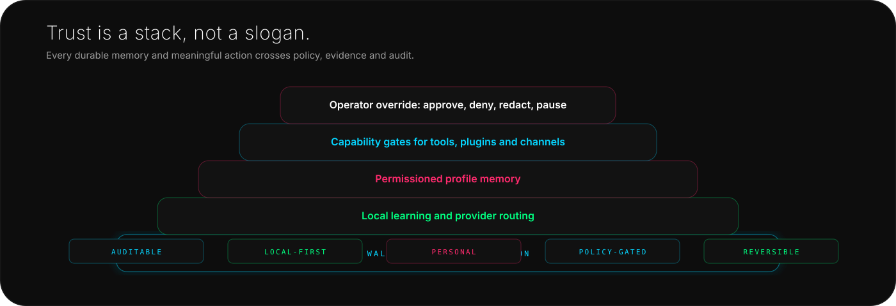
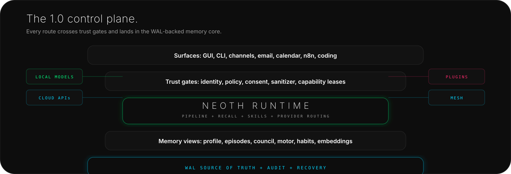

<!--
  NEOTH README - public 1.0 release narrative.
  This describes the intended public release surface, not an intermediate private build snapshot.
-->

<div align="center">


<br>

<h1>NEOTH</h1>

<h2>Stop reintroducing yourself to your AI.</h2>

<p>
  <strong>One private memory. Every approved surface. Evidence you can inspect.</strong>
</p>

<p>
  NEOTH is your private Jarvis-like buddy: useful for daily life, serious enough
  for operators, local-first by default. It remembers with permission, works
  across chat, code, Obsidian, Paperless, email, calendar, n8n, and your private
  mesh, and every sensitive action leaves an audit trail.
</p>

<p>
  <strong>Your buddy. Your memory. Your rules.</strong>
</p>

<p>
  <a href="#try-it-in-60-seconds"><strong>Try it</strong></a>
  -
  <a href="#why-neoth">Why NEOTH</a>
  -
  <a href="#release-surface">Release Surface</a>
  -
  <a href="#privacy-and-trust">Privacy</a>
  -
  <a href="#coding-buddy">Coding Buddy</a>
  -
  <a href="#where-neoth-fits">Comparison</a>
  -
  <a href="#the-engine">Engine</a>
  -
  <a href="#docs">Docs</a>
</p>

<p>
  <a href="https://github.com/The-Geek-Freaks/NEOTH/actions">
    
  </a>
  <a href="https://www.rust-lang.org">
    
  </a>
  <a href="#privacy-and-trust">
    
  </a>
  <a href="#try-it-in-60-seconds">
    
  </a>
  <a href="#coding-buddy">
    
  </a>
  <a href="#license">
    
  </a>
</p>

</div>

## Try it in 60 seconds

For normal users:

```bash
cargo install neoth
neoth gui
```

For terminal-first operators:

```bash
cargo install neoth
neoth init
neoth chat "Remember that I prefer direct answers and work mostly in Rust."
neoth recall "how do I like answers?"
neoth privacy audit --last 7d
```

You should see the remembered preference with evidence, confidence, and auditable destination history. The first run asks who you are, which provider or local model to use, what NEOTH may remember, which surfaces it may connect, and how much autonomy it gets.

YAML stays optional. The buddy is the default.

### What you can verify

```bash
neoth privacy audit --last 30d
neoth profile show --evidence
neoth wal verify
neoth plugin audit
neoth n8n status
neoth kanban watch
neoth cluster status
```


| Path | What happens |
| :-- | :-- |
| **I just want a helpful AI** | Open the GUI, choose local-first defaults, connect a chat app, and talk normally. |
| **I want a serious operator stack** | Use the CLI, local models, provider routing, plugins, WAL audit, private mesh, and coding dispatch. |
| **I want privacy proof** | Inspect profile facts, provider destinations, redactions, plugin capabilities, and WAL evidence. |

## Install

Public release:

```bash
cargo install neoth
```

From source:

```bash
git clone https://github.com/The-Geek-Freaks/NEOTH
cd NEOTH/SRC
cargo install --path neothd
cargo install --path neothd-gui
```

Linux/macOS no-sudo installer:

```bash
curl -fsSL https://raw.githubusercontent.com/The-Geek-Freaks/NEOTH/main/scripts/install.sh | bash
```

Windows:

```powershell
irm https://raw.githubusercontent.com/The-Geek-Freaks/NEOTH/main/scripts/install.ps1 | iex
```

Windows source builds use MSVC (`x86_64-pc-windows-msvc`). Use `scripts/cargo-msvc.ps1` for local source builds; GNU/MinGW is unsupported for the plugin registry path.

| Requirement | Why |
| :-- | :-- |
| Rust 1.86+ | Source builds and cargo install. |
| 2 GB free disk | WAL, SQLite views, cache, and local profile data. |
| 4 GB+ VRAM recommended | Local Qwen/Ouro path. CPU fallback works slower. |
| One provider or local model | Claude, OpenAI, Gemini-compatible, Qwen, or Ouro. |

## Why NEOTH



Most assistants are brilliant strangers. They answer one prompt, vanish, and make you rebuild context from zero.

NEOTH is built around **continuity and loyalty**. It learns your preferences, projects, routines, people, tools, infrastructure, decisions, and coding style only inside boundaries you control.

It is not here to harvest you, lock you in, or maximize engagement. It is here to help the operator: **you**.

> A chatbot impresses you once. A buddy gets useful over months.


### What NEOTH does every day

| Moment | Without NEOTH | With NEOTH |
| :-- | :-- | :-- |
| You start a new chat | You explain yourself again. | NEOTH already knows your approved style, tools, active projects, and constraints. |
| You switch from laptop to phone | Context splits across apps. | Same buddy through GUI, CLI, phone channels, team chat, Obsidian, and private mesh. |
| You forget a past decision | You search old chats manually. | Ask what you decided, when, and what evidence led there. |
| You change your mind | Old assumptions linger. | Redact, correct, pause, or re-learn profile facts. |
| You ask something high-impact | One model may bluff confidently. | NEOTH can trigger deeper roles and surface disagreement. |
| You want privacy proof | You trust a black box. | Run `neoth privacy audit` and inspect memory, destinations, and plugin access. |

### One buddy across surfaces


| For normal users | For operators |
| :-- | :-- |
| Guided setup, plain privacy choices, no YAML happy path. | Rust core, CLI, WAL, provider routing, local models, plugins, and audits. |
| Talk through GUI, phone channels, chat apps, or your knowledge base. | Script workflows, inspect memory, route models, verify logs, and pair private nodes. |
| Ask like a person: "remember this", "what did we decide?", "summarize my week". | Use `neoth recall`, `neoth privacy audit`, `neoth wal verify`, `neoth code`, and `neoth kanban watch`. |

## Release Surface

This is the intended public 1.0 surface: simple enough for normal users, explicit enough for pros.

| Area | 1.0 public surface | Notes |
| :-- | :-- | :-- |
| **Core** | GUI, CLI, profile memory, recall, privacy audit | Happy path requires no YAML. |
| **Channels** | Telegram, WhatsApp Business, Slack Socket Mode | WhatsApp requires Meta setup and public HTTPS. |
| **Extended channels** | Discord and Keet | Same channel adapter contract; Keet is the private-channel path. |
| **Local models** | Qwen for profile extraction, Ouro as optional thinking model | Cloud fallback for profile extraction is off unless explicitly enabled. |
| **Coding** | `neoth code`, planning canvas, Kanban, repo memory, review promotion | Operator-focused, visible, resumable. |
| **Automation** | Built-in cron plus n8n localhost API | Same policy and audit core. |
| **Life inputs** | Paperless, email, calendar, files, images, audio, video | Ingested into permissioned memory and recall views. |
| **Plugins** | Skills as data, WASM plugins with capability gates | No ambient filesystem or network access. |
| **Plugin trust** | Signatures, revocation list, capability ledger, hostcall WAL trail | Extensions stay inspectable after install. |
| **Private mesh** | LAN/mDNS, Tailscale, Hysteria, Keet, consent-gated nodes | Pairing requires operator approval. |

## Life Inputs And Automation

The core DAU promise is not "another chat box". NEOTH can remember and act around the real surfaces where life happens, while keeping approvals and audit trails visible.


| Surface | What NEOTH does | Boundary |
| :-- | :-- | :-- |
| **Paperless** | Turns OCR documents into grounded memory, notes, and recallable facts. | Prompt-injection gates and evidence tracking. |
| **Email** | Detects important messages, drafts replies, and remembers decisions. | Approval before send or durable profile changes. |
| **Calendar** | Reads schedule context, creates briefs, and proposes changes. | Operator-gated writes and destination audit. |
| **n8n** | Runs localhost workflows through a bearer-protected API. | Loopback by default, WAL audit for workflow calls. |
| **Cron** | Handles small local routines without forcing a workflow UI. | Same policy core as channels and plugins. |
| **Obsidian** | Keeps an operator-owned scratchpad: decisions, reflections, proposed actions, coding handoffs, and readable memory. | You can inspect the vault without NEOTH. |

Two concrete journeys:

| User | Flow |
| :-- | :-- |
| **Normal user** | Install -> chat app -> approved profile memory -> Paperless/email/calendar context -> morning brief -> privacy audit. |
| **Pro operator** | CLI -> repo memory -> coding canvas/Kanban -> plugin -> n8n workflow -> WAL audit -> private mesh. |

## Privacy And Trust



NEOTH treats the operator as the customer, not the data source.

| Trust default | What it means |
| :-- | :-- |
| **Permissioned memory** | Profile claims have evidence, confidence, redaction semantics, and operator-visible provenance. |
| **Local profile learning** | Qwen/Ouro can extract profile facts locally. No silent cloud fallback for private learning. |
| **Audited destinations** | Provider requests, plugin access, channel ingress, and memory writes are visible. |
| **Redaction guard** | Redacted profile facts are blocked from recreation unless you explicitly allow relearning. |
| **Plugin boundaries** | WASM plugins run with fuel limits, memory caps, timeouts, and hostcall allowlists. |
| **Operator override** | You can pause learning, inspect state, remove facts, and verify WAL integrity. |

```bash
neoth privacy audit --last 30d
neoth profile show --evidence
neoth profile redact identity.location
neoth wal verify
```

Private does not mean "trust us". Private means you can check.

### Obsidian and private mesh

NEOTH should fit into the knowledge system and network you already trust, not force everything into one app.


| Surface | What it is for |
| :-- | :-- |
| **Obsidian vault** | Human-readable memory mirror, project notes, decisions, skills, and long-term knowledge. |
| **LAN / mDNS** | Home and office discovery. |
| **Tailscale / WireGuard** | Private device mesh for laptop, workstation, home server, and travel machines. |
| **Hysteria** | Restricted-network relay path with explicit health, policy, and privacy behavior. |
| **Keet** | Peer-to-peer channel path for users who want less platform gravity. |
| **Cluster pairing** | Consent-gated NEOTH nodes with topology, capability scope, WAL events, and operator approval. |

```bash
neoth cluster discover
neoth cluster confirm <peer>
neoth cluster status
```

## Coding Buddy



NEOTH is not another chat UI taped to a repo. It can sit next to your project, remember the repo, plan work on a canvas, split tasks into Kanban, dispatch focused coding sessions, and keep review context from disappearing between runs.


```bash
neoth code "add a migration and tests for the profile baseline event" --dispatch
neoth kanban watch
neoth recall "why did we choose the WAL profile schema?"
```

| Workflow | What NEOTH does |
| :-- | :-- |
| **Plan** | Turns a prompt into scoped tasks, dependencies, acceptance criteria, and a reviewable coding canvas. |
| **Dispatch** | Sends small, obvious tasks to the fast role and ambiguous architecture or review work to the deep role. |
| **Track** | Keeps Backlog, Todo, In Progress, Review, Done, Blocked, and Archived visible in GUI and CLI Kanban views. |
| **Implement** | Works against repo context, remembered decisions, provider routing, and local/project constraints. |
| **Review** | Promotes findings, dissent, tests, and design decisions into durable memory instead of losing them in chat. |
| **Resume** | Recalls prior bugs, migrations, tradeoffs, and open threads without making you re-explain the repo. |

The point is not "AI writes code once". The point is a coding buddy that remembers the project, coordinates roles, improves its plans, and gives the operator a visible control surface.

## Where NEOTH Fits

Different projects optimize for different jobs. NEOTH's advantage is the overlap: loyal daily buddy, private memory, coding studio, and operator runtime in one system.


Legend: `✓` native/core focus, `◐` supported or adjacent, `−` not a clear project focus.

| Capability | NEOTH | Hermes | OpenHuman | OpenClaw |
| :-- | :--: | :--: | :--: | :--: |
| Daily buddy onboarding | ✓ | ◐ | ✓ | ◐ |
| Inspectable long-term memory | ✓ | ✓ | ✓ | ◐ |
| Coding workflow surface | ✓ | ✓ | ◐ | ◐ |
| Scheduled automation | ✓ | ✓ | ◐ | ✓ |
| Channels and device reach | ✓ | ◐ | ◐ | ✓ |
| Extension boundary | ✓ | ◐ | ◐ | ✓ |
| Operator audit and trust controls | ✓ | ◐ | ◐ | ◐ |

Where NEOTH dominates is the overlap, not a single isolated checkbox:

| Axis | NEOTH advantage |
| :-- | :-- |
| **Buddy** | OpenHuman is approachable, Hermes is operator-heavy, OpenClaw is gateway-heavy. NEOTH targets the missing middle: a loyal daily buddy with real operator depth. |
| **Memory** | Profile facts are evidence-backed, approval-aware, redactable, locally learnable, and tied to WAL events instead of opaque chat history. |
| **Coding** | Hermes-style workflow energy becomes native to repo memory, planning canvas, Kanban, review promotion, and provider roles. |
| **Privacy** | Local profile extraction, explicit provider routing, consent gates, plugin caps, and auditable outbound surfaces are part of the core product, not an afterthought. |
| **Ecosystem** | Obsidian, n8n, Paperless, email, calendar, local models, private mesh, and chat channels share one policy and memory core. |

Short version: Hermes is closest on persistent server-agent workflow. OpenHuman is closest on consumer-friendly memory and onboarding. OpenClaw is closest on gateway breadth and live-canvas energy. NEOTH's bet is the overlap: one local-first buddy with explicit profile learning, WAL-backed audit, coding workflow memory, and operator-controlled extensions.

Plain assistants are optimized for single conversations. IDE agents are optimized for one repo session. Vault tools are optimized for notes. NEOTH's job is continuity across all of them.

## The Engine



The engine exists to make the buddy trustworthy: memory is explicit, actions are gated, providers are routed, and every important transition can leave an audit trace.




### Three role-bound brain paths

| Role | Job | Why it matters |
| :-- | :-- | :-- |
| **Fast path** | Routine answers, small fixes, implementation, cheap model routing. | Keeps normal help responsive. |
| **Deep path** | Architecture, risk spotting, review, synthesis, hard questions. | Handles work where a shallow answer is not enough. |
| **Coordinator** | Message passing, dissent, tool outcomes, Kanban state, provider routing. | Makes the roles coordinate instead of becoming disconnected agents. |

### Six memory layers

| Layer | Job |
| :-- | :-- |
| **L1 Hot working set** | Current session, active canvas, active task state. |
| **L2 Warm cache** | Recent recall, high-use facts, short-term project context. |
| **L3 Episodic memory** | Conversations, events, timelines, decisions. |
| **L4 Semantic memory** | Embeddings, concepts, files, images, audio, video, related knowledge. |
| **L5 Knowledge and skills** | Lessons, routines, skill packs, tool success, provider habits. |
| **L6 Obsidian / vault mirror** | Human-readable long-term archive and operator-owned knowledge base. |

### Common commands

```bash
neoth init
neoth gui
neoth chat "what should I focus on today?"
neoth recall "the build failure from Tuesday"
neoth status
neoth doctor
neoth privacy audit
neoth model list
neoth plugin list
neoth cluster status
neoth code "plan the next migration" --dispatch
neoth kanban watch
neoth profile show --evidence
```

## Docs

| File | Purpose |
| :-- | :-- |
| [docs/getting-started.md](docs/getting-started.md) | First run, first chat, first channel. |
| [docs/install.md](docs/install.md) | Platform-specific install notes. |
| [docs/architecture.md](docs/architecture.md) | Runtime architecture and trust model. |
| [docs/cli-reference.md](docs/cli-reference.md) | Every command. |
| [docs/configuration.md](docs/configuration.md) | `freedom.yaml`, credentials, policy. |
| [docs/profile.md](docs/profile.md) | Profile memory, evidence, redaction, and recall behavior. |
| [docs/providers.md](docs/providers.md) | Claude, OpenAI, Gemini, local models. |
| [docs/channels.md](docs/channels.md) | Telegram, WhatsApp, Slack, Discord, Keet. |
| [docs/local-models.md](docs/local-models.md) | Qwen, Ouro, CLIP, Whisper. |
| [docs/plugins.md](docs/plugins.md) | Skills and WASM plugins. |
| [docs/council.md](docs/council.md) | Multi-model council design. |
| [docs/cron-vs-n8n.md](docs/cron-vs-n8n.md) | When to use built-in cron vs the n8n localhost API. |
| [docs/n8n-api.md](docs/n8n-api.md) | Loopback HTTP API: endpoints, bearer auth, audit trail, curl examples. |
| [docs/faq.md](docs/faq.md) | Product FAQ and tradeoffs. |
| [docs/troubleshooting.md](docs/troubleshooting.md) | Fix common setup problems. |

## Contributing

NEOTH is strict because the memory surface is sensitive.

```bash
cd SRC
cargo fmt --all
cargo clippy --workspace --tests -- -D warnings
cargo test --workspace
```

| Rule | Reason |
| :-- | :-- |
| No silent network surfaces | "Never phones home" must stay mechanically testable. |
| No unbounded plugin power | Every hostcall needs a declared capability. |
| No vague memory writes | Profile claims need evidence and redaction semantics. |
| No hostile setup | If a user must edit YAML for the happy path, the UX failed. |

See [CONTRIBUTING.md](CONTRIBUTING.md), [CODE_OF_CONDUCT.md](CODE_OF_CONDUCT.md), and [SECURITY.md](SECURITY.md).

## License

Licensed under either:

- MIT License ([LICENSE-MIT](LICENSE-MIT))
- Apache License, Version 2.0 ([LICENSE-APACHE](LICENSE-APACHE))

at your option.

<br>

<div align="center">

<strong>NEOTH - Neural Engine Obligated To Help</strong>

<br><br>

<code>cargo install neoth && neoth gui</code>

</div>
