<!--
  NEOTH README - public v1.1 release narrative.
  This is written for the intended v1.1 release surface, not for an
  intermediate private build snapshot.
-->

<div align="center">


<br>

<h3>The Sovereign AI Buddy.</h3>

<p>
  <strong>Neoth knows. Neoth helps. Neoth stays yours.</strong>
</p>

<p>
  <a href="#act-i---the-sovereignty">Why NEOTH</a>
  -
  <a href="#act-ii---the-buddy">Start in 60 seconds</a>
  -
  <a href="#act-iii---the-engine">How it works</a>
  -
  <a href="#privacy-by-default">Privacy</a>
  -
  <a href="#docs">Docs</a>
</p>

<p>
  <a href="https://github.com/The-Geek-Freaks/NEOTH/actions">
    
  </a>
  <a href="https://www.rust-lang.org">
    
  </a>
  <a href="#license">
    
  </a>
  <a href="#privacy-by-default">
    
  </a>
  <a href="#install">
    
  </a>
</p>

</div>

<br>


<br>


<br>

# Act I - The Sovereignty

### Your AI should not forget you every morning.

Most assistants are brilliant strangers. They answer, vanish, and make you repeat your context forever.

NEOTH is built around **continuity**. It remembers what you allow it to remember, keeps that memory under your control, and follows you across terminal, desktop, phone, and team chat.

It is not just a chatbot. It is your long-term operator layer.

| What you get | What that means in real life |
| :-- | :-- |
| **One buddy across every surface** | CLI, GUI, Telegram, WhatsApp, Slack, Discord, Keet - same memory, same profile, same operator. |
| **Memory that survives sessions** | Decisions, projects, preferences, people, infrastructure, and recurring patterns stop disappearing. |
| **Local profile extraction** | Raw conversation windows are analyzed by local Qwen/Ouro instead of a second cloud vendor. |
| **Multi-model council** | Fast answers stay fast. High-impact questions can trigger deeper roles and dissent. |
| **Noob-safe setup** | The wizard asks human questions. You should not need to understand YAML, WALs, tokens, or model routing. |
| **Pro-grade internals** | Rust, event-sourced WAL, HLC timestamps, HMAC compaction, policy gates, plugin sandboxing, testable invariants. |

### The promise

> In Thoth's scales, only memory has weight.

NEOTH exists to reduce repeated context, lost knowledge, and dependency on platforms that do not remember you.

It can be a quiet assistant for normal people. It can be a local-first command center for engineers. Same binary.

<br>

<table>
  <tr>
    <td width="33%">
      <strong>For normal humans</strong><br>
      Install it. Open the wizard. Connect a chat app. Talk normally. NEOTH handles the machinery.
    </td>
    <td width="33%">
      <strong>For builders</strong><br>
      Use the CLI, WAL, skills, plugins, provider routing, recall, cluster mode, and coding sessions.
    </td>
    <td width="33%">
      <strong>For paranoid operators</strong><br>
      Audit requests, redact profile facts, disable cloud fallback, inspect every memory trail.
    </td>
  </tr>
</table>

<br>


<br>


<br>

# Act II - The Buddy

### Start in 60 seconds

```bash
cargo install neoth
neoth init
neoth chat "Remember that I prefer short answers and work mostly in Rust."
neoth recall "what do you know about how I like to work?"
```

Prefer a visual setup?

```bash
neoth gui
```

The GUI walks you through identity, provider choice, local models, autonomy level, channels, privacy defaults, and buddy discovery. The terminal wizard mirrors the same flow for SSH and server installs.

### What the first run feels like

```text
$ neoth init

NEOTH
Your Buddy, Your Life

1. Who are you?
2. Where should NEOTH talk to you?
3. Which model should answer quickly?
4. Which local model should learn your profile?
5. How autonomous may it be?
6. Should your other NEOTH devices find this one?

Done. Say hello:

$ neoth chat "hello"
Neoth: I'm here. What should I remember first?
```

### The noob path

You do not need to know what a daemon is.

1. Install NEOTH.
2. Run the wizard.
3. Pick "local-first" if you are unsure.
4. Connect Telegram, WhatsApp, Slack, Discord, or Keet.
5. Talk to NEOTH like a person.
6. Use `neoth privacy audit` whenever you want to see what it knows and where requests went.

### The power path

You get the full operator surface when you want it.

```bash
neoth status
neoth doctor
neoth model fetch qwen
neoth model fetch ouro-1.4b-thinking
neoth ingest ~/Downloads/meeting.mp3
neoth recall "the router issue from last month" --since 90d
neoth privacy audit --last 30d
neoth cluster discover
neoth code "add a migration and tests for the profile baseline event" --dispatch
```

### The daily loop

| Moment | NEOTH behavior |
| :-- | :-- |
| You mention a preference | It can become a profile claim with evidence, confidence, and redaction controls. |
| You ask about old context | It recalls episodes, profile facts, files, images, audio, and prior decisions. |
| You ask something hard | It can route through a council instead of forcing one model to bluff alone. |
| You connect a new device | Cluster discovery can pair it into your memory mesh after consent. |
| You install a plugin | WASM permissions, memory caps, fuel limits, and hostcall allowlists contain it. |

<br>


<br>


<br>

# Act III - The Engine

### One memory, many surfaces


### The six memory regions



| Region | View | Purpose |
| :-- | :-- | :-- |
| Hippocampus | `idx_episode` | Conversations, events, and time-anchored recall. |
| Amygdala | `idx_importance` | Salience, urgency, and priority signals. |
| Insula | `idx_council` | Debate logs, dissent, and verdict traces. |
| Cerebellum | `idx_motor` | Provider quotas, rate limits, tool outcomes, execution state. |
| Basal Ganglia | `idx_habit` | Repeated patterns, skills, triggers, routines. |
| Hypothalamus | `idx_profile` | Long-term operator profile, evidence, redactions. |

### Feature map

| Area | v1.1 release behavior |
| :-- | :-- |
| **Install** | Single Rust binary plus optional Slint GUI. No Docker stack required. |
| **Onboarding** | CLI wizard and GUI wizard with plain-language defaults. |
| **Channels** | CLI, GUI, Telegram, WhatsApp Business, Slack Socket Mode, Discord, Keet. |
| **Memory** | WAL-backed long-term memory, profile claims, multimodal recall, redaction registry. |
| **Models** | Claude, OpenAI, Gemini, OpenAI-compatible, local Qwen, local Ouro thinking models. |
| **Council** | Smart trigger, daily budget, dissent surfacing, provider role binding. |
| **Local inference** | Qwen for profile extraction; Ouro as optional thinking/reasoning provider. |
| **Multimodal** | PDF, image, audio, and video ingestion with local embeddings/transcription paths. |
| **Coding** | `neoth code --dispatch`, kanban sessions, sub-agent roles, review promotion. |
| **Plugins** | Skills as data, plugins as code, WASM runtime with resource limits. |
| **Cluster** | LAN/mDNS and Tailscale pairing; Hysteria relay path for restricted networks. |
| **Ops** | `doctor`, `status`, `privacy audit`, `wal verify`, backup, self-update, release signing. |

### Release surface

| Surface | v1.1 public release line |
| :-- | :-- |
| Core channels | CLI, GUI, Telegram, WhatsApp Business, Slack Socket Mode. |
| Extended channels | Discord and Keet, exposed behind the same channel adapter contract. |
| Local model choices | Qwen as default local memory model; Ouro as optional thinking model. |
| Cluster | LAN/mDNS and Tailscale first; Hysteria relay is the advanced route for hard networks. |
| Cloud | Explicit provider choice only. No silent profile-extraction fallback. |

### Why the council matters

NEOTH does not ask every model every time. That is expensive and slow.

Instead, the council triggers when a message is complex, risky, contradictory, high-impact, or operator-configured. The fast model handles normal chat. The deep role watches patterns. The synthesis role exposes disagreement before it turns into confident nonsense.

```toml
[council.budget]
max_debates_per_day = 5
max_usd_per_day = 2.00
trigger = "smart"
```

### Privacy by default

NEOTH is designed around a hard distinction:

| Data | Default |
| :-- | :-- |
| Raw conversation memory | Local WAL. |
| Profile extraction | Local Qwen/Ouro. |
| Cloud fallback for extraction | Off unless you explicitly enable it. |
| Provider requests | Audited by destination. |
| Redacted profile facts | Blocked from recreation unless you allow relearning. |
| Plugin capabilities | Declared, capped, and audited. |
| New network surfaces | Must pass explicit no-phone-home invariants. |

Run:

```bash
neoth privacy audit --last 30d
neoth profile show --evidence
neoth profile redact identity.location
neoth wal verify
```

### Local models

| Model | Role | Why it exists |
| :-- | :-- | :-- |
| Qwen | Local profile extraction and embeddings | Private, bilingual, cheap, good enough for continuous learning. |
| Ouro | Local thinking/reasoning alternative | Looped transformer reasoning without sending the prompt to a cloud API. |
| CLIP | Image embeddings | Cross-modal recall for images and visual files. |
| Whisper | Audio transcription | Voice notes, meetings, and video audio tracks. |

```bash
neoth model list
neoth model fetch qwen
neoth model fetch ouro-1.4b-thinking
neoth model fetch clip
neoth model fetch whisper
```

### Plugins without giving them the keys to your life

NEOTH has two extension surfaces:

| Surface | Best for | Safety model |
| :-- | :-- | :-- |
| Skills | Context, instructions, templates, domain knowledge | Data-only, hot-reloadable, no code execution. |
| WASM plugins | Real logic at lifecycle hooks | Fuel limit, 64 MiB memory cap, timeout, hostcall allowlist, no ambient filesystem/network. |

```text
~/.neoth/plugins/my-plugin/
  plugin.toml
  my-plugin.wasm
```

### Cluster mode

Run NEOTH on a laptop, workstation, and home server without manually copying state.

| Surface | Use case |
| :-- | :-- |
| LAN / mDNS | Home and office devices. |
| Tailscale / WireGuard | Private mesh across locations. |
| Hysteria relay | Advanced relay path for hard networks, travel, and restricted environments. |

Pairing is consent-gated. A peer with the right key still needs approval before it joins your memory cluster.

```bash
neoth cluster discover
neoth cluster confirm <peer>
neoth cluster status
```

### Compared to normal assistants

| Question | Normal assistant | NEOTH |
| :-- | :-- | :-- |
| Does it remember across months? | Usually no, or only inside vendor history. | Yes, in your local WAL and profile views. |
| Can you audit what it knows? | Rarely. | Yes: evidence, confidence, redactions, destination audit. |
| Can it run where you talk? | Usually one app. | CLI, GUI, chat channels, and cluster devices. |
| Can it use multiple models by role? | Sometimes manually. | Yes, with role binding and smart council triggers. |
| Can you extend it safely? | Usually scripts or hosted integrations. | Skills and WASM plugins with explicit capability boundaries. |
| Is setup friendly to non-engineers? | Often no. | Wizard-first. YAML only when you want it. |

<br>


<br>

### Install

For the public release:

```bash
cargo install neoth
```

From source:

```bash
git clone https://github.com/The-Geek-Freaks/NEOTH
cd NEOTH/SRC
cargo install --path neothd
cargo install --path neothd-gui
```

Linux/macOS no-sudo installer:

```bash
curl -fsSL https://raw.githubusercontent.com/The-Geek-Freaks/NEOTH/main/scripts/install.sh | bash
```

Windows:

```powershell
irm https://raw.githubusercontent.com/The-Geek-Freaks/NEOTH/main/scripts/install.ps1 | iex
```

Requirements:

| Requirement | Why |
| :-- | :-- |
| Rust 1.86+ | Source builds and cargo install. |
| 2 GB free disk | WAL, SQLite views, basic cache. |
| 4 GB+ VRAM recommended | Local Qwen/Ouro path. CPU fallback works slower. |
| One provider or local model | Claude/OpenAI/Gemini-compatible or Qwen/Ouro. |

### Common commands

```bash
neoth init
neoth gui
neoth chat "what should I focus on today?"
neoth recall "the build failure from Tuesday"
neoth status
neoth doctor
neoth privacy audit
neoth model list
neoth plugin list
neoth cluster status
```

### Docs

| File | Purpose |
| :-- | :-- |
| [docs/getting-started.md](docs/getting-started.md) | First run, first chat, first channel. |
| [docs/install.md](docs/install.md) | Platform-specific install notes. |
| [docs/cli-reference.md](docs/cli-reference.md) | Every command. |
| [docs/configuration.md](docs/configuration.md) | `freedom.yaml`, credentials, policy. |
| [docs/providers.md](docs/providers.md) | Claude, OpenAI, Gemini, local models. |
| [docs/channels.md](docs/channels.md) | Telegram, WhatsApp, Slack, Discord, Keet. |
| [docs/local-models.md](docs/local-models.md) | Qwen, Ouro, CLIP, Whisper. |
| [docs/plugins.md](docs/plugins.md) | Skills and WASM plugins. |
| [docs/council.md](docs/council.md) | Multi-model council design. |
| [docs/troubleshooting.md](docs/troubleshooting.md) | Fix common setup problems. |

### Design sources

The public release line follows the v1.1 design:

| File | Why it matters |
| :-- | :-- |
| [PLAN/00_DESIGN_v1.1_FINAL.md](PLAN/00_DESIGN_v1.1_FINAL.md) | Normative architecture. |
| [PLAN/SPEC_local_inference.md](PLAN/SPEC_local_inference.md) | Local Qwen privacy fix. |
| [PLAN/SPEC_ouro_thinking_provider_2026-05-23.md](PLAN/SPEC_ouro_thinking_provider_2026-05-23.md) | Ouro provider path. |
| [PLAN/SPEC_skill_plugin_system.md](PLAN/SPEC_skill_plugin_system.md) | Skills, plugins, capability boundaries. |
| [PLAN/SPEC_cluster_auto_discovery_2026-05-22.md](PLAN/SPEC_cluster_auto_discovery_2026-05-22.md) | Cluster discovery and pairing. |

### Contributing

NEOTH is strict because the memory surface is sensitive.

```bash
cd SRC
cargo fmt --all
cargo clippy --workspace --tests -- -D warnings
cargo test --workspace
```

Rules:

| Rule | Reason |
| :-- | :-- |
| No silent network surfaces | "Never phones home" must stay mechanically testable. |
| No unbounded plugin power | Every hostcall needs a declared capability. |
| No vague memory writes | Profile claims need evidence and redaction semantics. |
| No noob-hostile setup | If a user must edit YAML for the happy path, the UX failed. |

See [CONTRIBUTING.md](CONTRIBUTING.md), [CODE_OF_CONDUCT.md](CODE_OF_CONDUCT.md), and [SECURITY.md](SECURITY.md).

### License

Licensed under either:

- MIT License ([LICENSE-MIT](LICENSE-MIT))
- Apache License, Version 2.0 ([LICENSE-APACHE](LICENSE-APACHE))

at your option.

<br>


<br>

<div align="center">



<br>

<strong>Neoth knows. Neoth helps. Neoth stays yours.</strong>

<br><br>

<sub>NEOTH - Neural Engine Obligated To Help - v1.1 Sovereign Buddy</sub>

</div>
 
