<div align="center">


<h1>NEOTH</h1>

<h3>Your private AI buddy. Loyal to you. Useful everywhere.</h3>

<p>
  <strong>One memory. Three brain paths. Five memory tiers + your vault. Local-first by default.</strong>
</p>

<p>
  NEOTH is the personal AI system for people who want a real assistant, not a
  forgetful chatbot. It remembers what you approve, helps in daily life, codes
  seriously, connects to your tools, runs on your own machine, and leaves typed
  audit proof for its governed sensitive paths, with exceptions documented in
  the threat model.
</p>

<p>
  <strong>Normal user?</strong> Open the GUI and talk — no YAML.
  &nbsp;·&nbsp; <strong>Pro?</strong> Every claim has a CLI command that proves it.
  &nbsp;·&nbsp; <strong>Skeptic?</strong> <a href="docs/evaluation.md">15 minutes, proof on your own machine</a>.
</p>

<p>
  <a href="#install"><strong>Install</strong></a>
  · <a href="#why-neoth">Why NEOTH</a>
  · <a href="#demo-loops">Demos</a>
  · <a href="#for-normal-users-and-pros">DAUs + Pros</a>
  · <a href="#privacy">Privacy</a>
  · <a href="#coding-buddy">Coding</a>
  · <a href="#babel-index-it-predicts-its-own-collapse">Babel-Index</a>
  · <a href="#comparison">Comparison</a>
  · <a href="#docs">Docs</a>
</p>

<p>
  <a href="https://github.com/The-Geek-Freaks/NEOTH/actions">
    
  </a>
  <a href="#privacy">
    
  </a>
  <a href="#coding-buddy">
    
  </a>
  <a href="#privacy">
    
  </a>
  <a href="#license">
    
  </a>
  <a href="https://deepwiki.com/The-Geek-Freaks/NEOTH">
    
  </a>
</p>

</div>

## Install

> The source tree is versioned for **NEOTH 1.0.0**, but no `v1.0.0` release or
> crates.io package exists yet. The current working install path is the source
> checkout below. The bootstrap commands become valid only after the first
> compatible signed release is published; `cargo install neoth --locked --features release-desktop`
> becomes valid
> only after the ordered SDK + core crates.io publication completes.

Current install (source checkout):

```bash
git clone https://github.com/The-Geek-Freaks/NEOTH
cd NEOTH
NEOTH_SRC_DIR="$PWD" bash scripts/install.sh
neoth
```

The all-components source installer needs Node.js 22.16+ to compile the Keet
standalone. Signed desktop archives bundle it and need no Node.js.

After the first signed release, one-command install (Linux/macOS):

```bash
curl -fsSL https://raw.githubusercontent.com/The-Geek-Freaks/NEOTH/main/SRC/install.sh | bash
export PATH="$HOME/.local/bin:$PATH" # profile wiring applies automatically to new shells
neoth
```

The binary installer always verifies SHA-256 plus release authenticity. It uses
an installed `minisign` with the
[pinned public key](NEOTH_RELEASE_MINISIGN_PUBKEY.txt), an installed `cosign`, or
downloads a temporary Cosign verifier whose platform SHA-256 is pinned to an
immutable official Sigstore source commit. A clean machine therefore needs no
preinstalled verifier. A downloaded verifier with the wrong digest is never
executed; `NEOTH_ALLOW_UNVERIFIED_RECOVERY=1` applies only when the verifier
cannot be downloaded and the archive was authenticated out of band.

Desktop archives contain `neoth`, the `neothd` compatibility launcher, the
separate `neothd-gui` binary consumed by bare `neoth` and `neoth gui`, `neoth-migrate`, and
`neoth-relay`, plus the zero-dependency `neoth-keet-bridge` standalone. They
also carry a release-bound Graphify map of the exact tagged source tree; NEOTH
verifies its source HEAD, version, closed file set, and payload hash before
using it. Graphify and Python are build-time release inputs, not user
dependencies. Only the
explicitly headless musl server archive omits the GUI and the glibc-linked Keet
companion.
The future crates.io package installs only the `neoth`/`neothd` core package;
use a release archive or source checkout for the companion executables.

After the first signed release, Windows users can download and double-click the
signed `NEOTH-1.0.0-x64-Setup.exe` (or ARM64 variant) on the Releases page. The
zero-prompt PowerShell alternative is:

```powershell
irm https://raw.githubusercontent.com/The-Geek-Freaks/NEOTH/main/SRC/install.ps1 | iex
neoth
```

Bare `neoth` is the product launcher. On the first display-bearing launch it
shows one accessible **Graphical setup / Command-line setup** choice and stores
the answer in the active `NEOTH_HOME`; later launches go straight to that
surface. SSH, CI, Windows Session 0, and other headless sessions stay in the
CLI. Automation can choose explicitly with `NEOTH_INTERFACE=gui` or
`NEOTH_INTERFACE=cli` (exact lowercase values). Switch at any time with `neoth gui`,
`neoth interface set cli`, or **Open CLI** in the GUI.

Then run the health check:

```bash
neoth doctor
neoth doctor --explain "freedom.yaml"
```

The wizard asks normal questions: who you are, what NEOTH may remember, whether
you want local-only or cloud providers, which channels to connect, and how much
autonomy NEOTH gets. YAML is optional. The happy path is a GUI path.

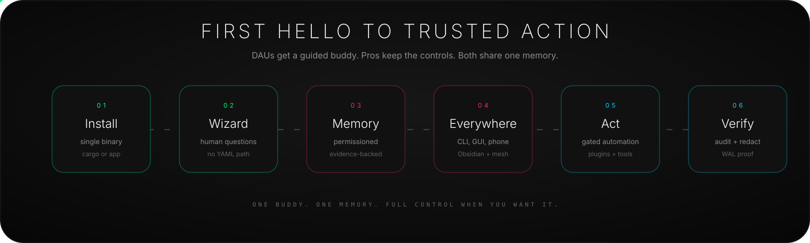

## Demo Loops

| First run | Memory proof |
| :-- | :-- |
|  |  |

| Coding buddy | Privacy audit |
| :-- | :-- |
| 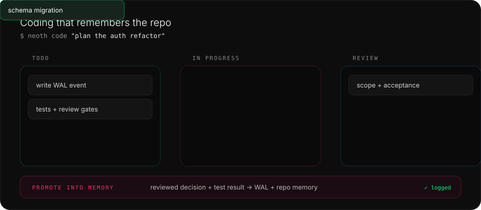 |  |

## Why NEOTH

Most AI tools are brilliant strangers. They can answer one prompt, but they do
not really know you, cannot prove what they remembered, and quietly move the
trust boundary to someone else's backend.

NEOTH is built around a different promise:

> The AI should be loyal to the user, not to a platform.

That means:

| Principle | What it means in practice |
| :-- | :-- |
| **Your memory** | Profile facts, project context, decisions, and recall live in your NEOTH home. |
| **Your consent** | Sensitive profile changes, provider routes, plugins, and external actions are inspectable. |
| **Your tools** | CLI, GUI, chat channels, Obsidian, Paperless, CalDAV calendar, optional source-build IMAP email, n8n, local models, and private mesh. |
| **Your proof** | WAL-backed audit, evidence-linked profile facts, plugin capability logs, and privacy commands. |
| **Your upgrade path** | Starts simple, scales into a serious operator runtime without switching products. |

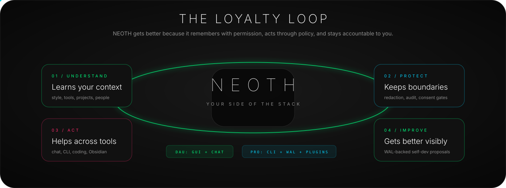

## For Normal Users And Pros

NEOTH is deliberately not only for developers. The core product is a buddy that
can be used by a normal person, while still staying deep enough for a senior
operator.

| If you are a normal user | If you are a pro |
| :-- | :-- |
| Open the GUI and talk normally. | Use the CLI, local models, WAL, policies, plugins, and cluster commands. |
| Say "remember this" and approve what matters. | Inspect exact evidence, confidence, provider destination, and redaction state. |
| Connect Telegram, Slack, WhatsApp, Obsidian, Paperless, and CalDAV calendar; source builds can opt into IMAP triage. | Script workflows, bind n8n, define hooks, use MCP, and review plugin capabilities. |
| Ask "what did we decide?" and get useful recall. | Run `neoth recall`, `neoth verify`, `neoth privacy audit`, `neoth plugin ledger`. |
| Let NEOTH explain setup problems in plain language. | Pipe `neoth doctor --output json` into CI or fleet checks. |

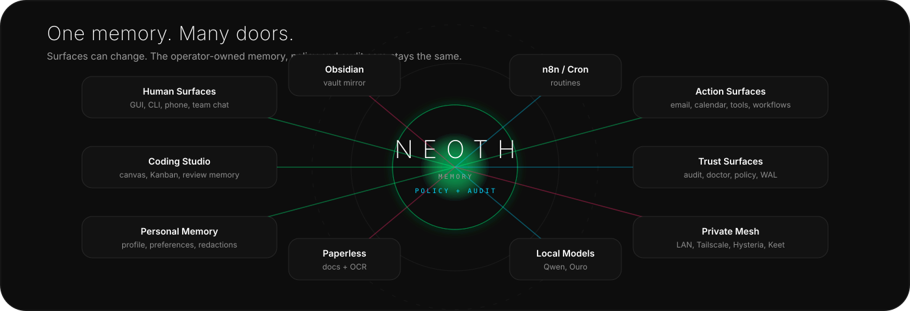

## What NEOTH Does

| Area | 1.0 target behavior |
| :-- | :-- |
| **Buddy** | Keeps approved facts separate from a default-on local communication profile. It adapts presentation without storing raw messages or inferring diagnoses; inspect, pin, explain or reset it with `neoth profile communication ...`. Native GUI/Buddy controls are still a Gold parity item. |
| **Brain** | Routes work through role-bound brain paths for fast answers, deeper reasoning, and verification. |
| **Memory** | Uses five durable memory tiers — episode, profile, ground truth, consolidated, long-term — plus your external vault (Obsidian/Paperless) ingested into them. |
| **Daily life** | Ingests Paperless documents, CalDAV calendar, notes, files, images, audio, and video into reviewable memory; IMAP inbox triage is a source-build opt-in and has no SMTP/send path. |
| **Coding** | Plans work, tracks tasks on a canvas/Kanban board, runs checks, learns repo context, and promotes reviewed decisions into memory. |
| **Self-diagnosis** | Scores its own event stream for collapse risk (Babel-Index): seven variables per rolling window, pre-registered failure labels, early warning before the agent loop — not after. |
| **Self-reflection** | Looks back on its own work — weekly topic recap plus opt-in daily and yearly summaries archived and written to Obsidian as daily notes / yearly summaries — runs an opt-in weekly Hacker News tech-currency scan that flags trending topics your skills don't cover, and proposes review-gated SkillOpt improvements to its own skills (never auto-applied). |
| **Self-evolution** | Dreams nightly (`neoth dream now`): clusters the week's episodes into themes and writes them to Obsidian. Proposes, council-reviews, and applies upgrades to its own skills with rollback (`neoth self-improve`). Notices its own behavioral patterns and proposes changes you approve or decline (`neoth self-dev`). Distills tool sequences you repeat into candidate skills (`neoth distill`). |
| **Migration** | Brings your history with you: `neoth-migrate detect` discovers complete OpenClaw, Hermes, OpenHuman, and Veronica homes; dry-run previews them and consent-gated atomic apply imports their local memory as reviewable candidates. `neoth import session` covers Claude Code / Codex / Gemini transcripts, and `neoth transfer export` moves whole memories between machines as X25519-encrypted, Ed25519-signed bundles. |
| **Autonomy** | Four built-in levels (`strict` through `full`) plus `custom`: a Standard baseline with exhaustive per-action `allow` / `confirm` / `deny` overrides in `freedom.yaml`; `neoth permissions show/check/set/clear` exposes and edits the active policy atomically. Custom cannot weaken Full's hard safety floor, and unattended cron/auto-update stay fail-closed; one-word `neoth sudomode`; your own plain-YAML constitution is injected before every prompt (`neoth moral-core`). |
| **Gateway** | OpenAI-compatible endpoint (`/v1/chat/completions`): point Cursor, Aider, or Continue at NEOTH and every call gets your provider routing, council, and audit trail. |
| **Loops** | `neoth loop run "<goal>" --until "<criterion>"` — bounded autonomous iteration with L1-L3 budget ladders, full history in `neoth loop history`. |
| **Recon** | Authorized-engagement recon through gated `uncover` (exposed-host discovery) and `tlsx` (TLS/cert intel) shims — refused under Strict autonomy and audit-logged. |
| **Automation** | Runs small local cron jobs and larger n8n workflows through a default-off, scoped localhost API with endpoint-specific consent and WAL auditing. |
| **Channels** | One canonical GUI/CLI registry for Telegram, Slack, WhatsApp Business, repository-owned WhatsApp Web/Baileys, Discord, Signal, LINE, IRC, iMessage through BlueBubbles, Mattermost, Google Chat, Matrix, Twitch, Nostr, and the full-duplex Keet-identity Pear/Hyperswarm companion. Private/work inbound adapters require an exact operator identity in addition to transport authentication; missing policies keep them off and mismatches are WAL-audited before the pipeline. Read-only live probes are shared by both surfaces, and hot credential/policy rotation restarts only the affected adapter. The Keet companion creates private NEOTH topics; it does not claim access to existing Keet app rooms because no supported room/message API exists. |
| **Private mesh** | Pairs nodes over LAN/mDNS, Tailscale, Hysteria, and consent-gated cluster discovery. |
| **Extensions** | Installs Skills as bounded, no-follow data generations with typed receipts; explicit external-Skill activation/tool authority remains a Gold blocker. WASM code uses exact-digest operator approval, runtime capability checks, revocation and hostcall audit. |
| **Doctor** | Explains broken setup, missing keys, model cache problems, channel wiring, disk issues, plugin state, provider flapping, and cluster discovery. |

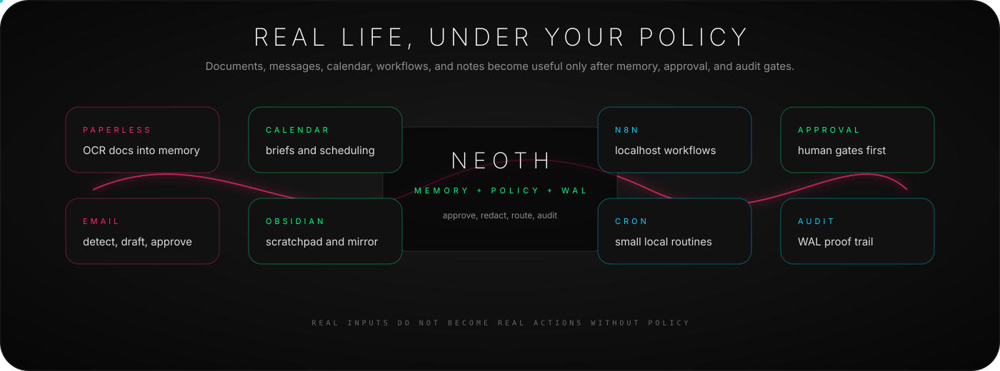

## Privacy

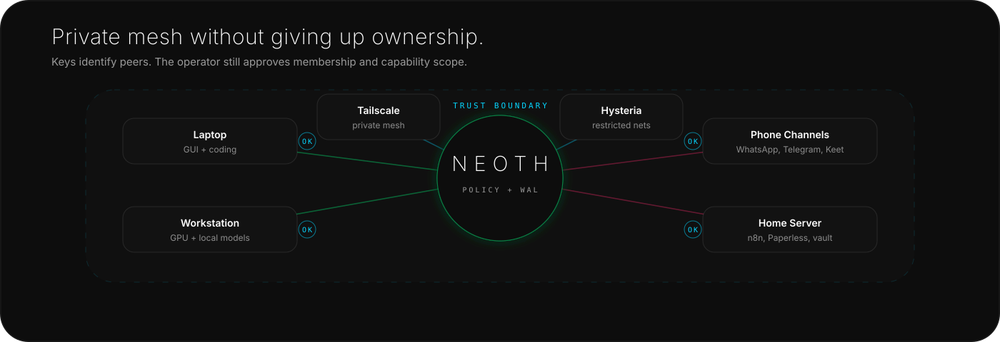

NEOTH is local-first and fail-closed by design.

| Guarantee | How to verify |
| :-- | :-- |
| **No silent profile extraction to cloud** | `neoth privacy audit --last 30d` (recent provider calls + profile writes + channel egress) |
| **No silent provider fallback** | `neoth provider list` and `neoth wal show --type provider_fallback_attempted` (every 429 failover is a durable audit frame) |
| **No ambient plugin power** | `neoth plugin ledger` (capabilities used) and `neoth wal show --type plugin_cap_denied` (over-level calls refused at runtime) |
| **No invisible memory mutation** | `neoth profile pending` and `neoth profile show` |
| **No hidden communication label** | `neoth profile communication status` and `show`; the default provider prompt exports accommodations only, and neuro-context exists only after an explicit typed declaration |
| **No unverifiable history** | `neoth verify` |
| **No accidental channel writes** | approval policy plus WAL events for outbound actions |

Local-only mode is a first-class path:

```bash
neoth preset activate fully-local
neoth preset apply fully-local
neoth doctor
neoth privacy audit --last 30d
```

Read the full privacy model in [docs/privacy.md](docs/privacy.md).

> **Security-research skills ship enabled by default.** NEOTH bundles three dual-use
> registers — `lowkey_base` (authorised security research / defensive analysis), `raskal`
> (authorised red-team / offensive-tooling), and `archon` (meta-reasoning orchestrator).
> They are operator-authorisation-scoped — they refuse mass-harm, untargeted destruction,
> and out-of-scope targets — and ship **enabled** so an authorised pentester gets working
> tooling instead of refusals. Don't want them? Disable any subset in `freedom.yaml`:
>
> ```yaml
> skills:
>   disabled:
>     - raskal
>     - archon
> ```
>
> (Or suppress *all* skill injection for benchmark/eval runs with
> `skills.disabled_for_eval_sessions: true`.)

## Why it holds up

The differentiators are mechanisms you can inspect, not slogans.

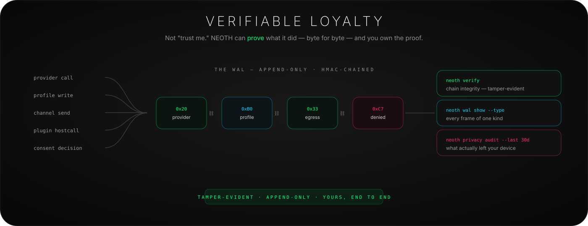

Governed sensitive paths emit typed events into an append-only, HMAC-chained
WAL — and you get the commands to prove what was recorded: `neoth verify`
(chain integrity),
`neoth wal show --type <event>` (every frame of one kind), `neoth privacy audit --last 30d`
(recorded provider/channel/privacy activity). Audit coverage and explicit
best-effort or log-only exceptions are listed in the
[threat model](docs/security/threat-model.md); chain verification proves that
recorded frames were not altered, not that every possible side effect emitted
a frame.

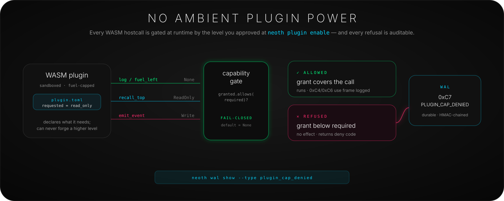

A WASM plugin built against the versioned `neoth-plugin-sdk` guest ABI exports
`neoth_abi_version() -> i32` plus `neoth_run() -> i32`; the daemon checks ABI v1
before execution. It can only use the hostcalls its manifest declared and you
approved at `neoth plugin enable`.
That approval is bound to the exact permission, canonical
manifest digest, and WASM digest: any later semantic manifest, capability, or binary
change cannot load on the next daemon start until you explicitly re-enable it. The
running daemon keeps only its already-validated immutable module, approval, and
manifest-derived fuel/memory-limit snapshot. A call
above the approved level is refused fail-closed at runtime and recorded as a
`0xC7 PLUGIN_CAP_DENIED` audit frame — visible in
`neoth wal show --type plugin_cap_denied`, never silent.

Skills have a deliberately different boundary. They are prompt/data packages,
not executable WASM modules, so a Skill install receipt proves exact bytes and
transactional publication but is not a code-signature or capability approval.
The external-Skill provenance/activation/effective-tool-scope contract remains
open for v1.0; NEOTH does not market the WASM sandbox as protection for Skills.

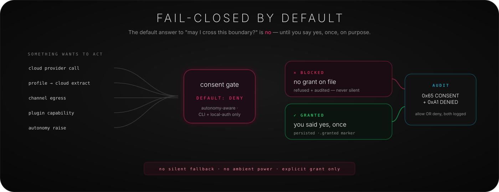

Crossing a trust boundary — cloud call, profile-to-cloud extract, channel egress,
plugin capability, autonomy raise — is denied by default until you grant it once,
on purpose. Both the grant and the refusal are logged.

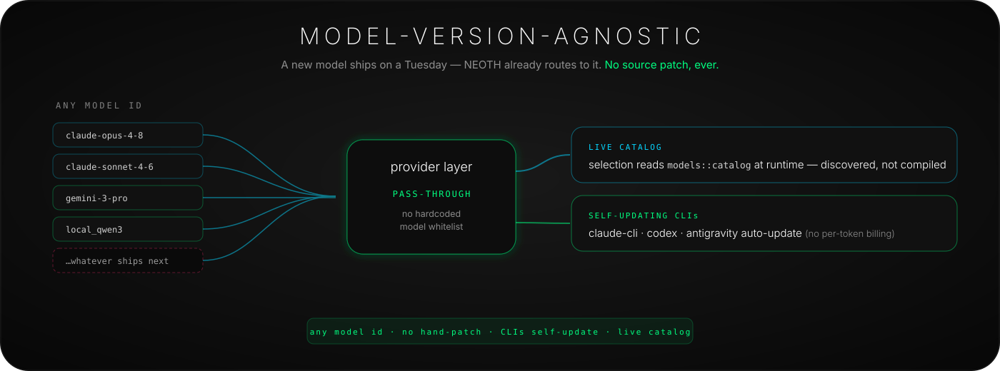

Any model id passes through the provider layer with no hardcoded whitelist; the
managed CLIs (claude-cli / codex / antigravity) self-update and the model catalog is
discovered at runtime — so a new model ships and NEOTH already routes to it, no source
patch.

## Coding Buddy

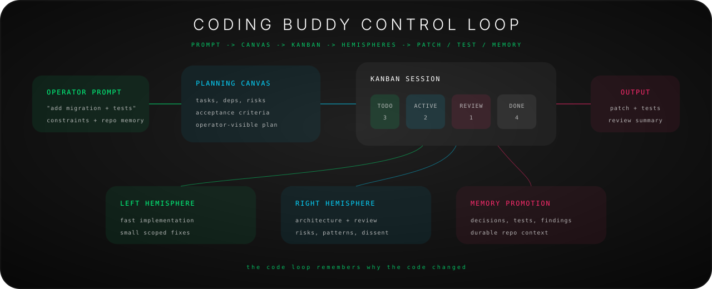

NEOTH is not a coding toy bolted onto a chat app. The coding path is designed
for visible planning, reviewable execution, and memory that improves future
work.

| Step | What NEOTH does |
| :-- | :-- |
| **Plan** | Turns a request into a scoped plan, risk list, and acceptance checks. |
| **Map** | Reads repo context, prior decisions, docs, issue state, and coding memory. |
| **Track** | Keeps backlog, todo, in-progress, review, done, blocked, and archived states visible. |
| **Execute** | Runs local checks, cargo/test/lint loops, and targeted implementation flows. |
| **Review** | Separates code generation from review, promotes only validated decisions into memory. |
| **Improve** | Learns repo conventions and recurring fixes without swallowing secrets or unapproved facts. |

Operator commands:

```bash
neoth code "plan the auth refactor"
neoth kanban watch
neoth code check
neoth recall "why did we choose this storage layout?"
```

## Brain And Memory

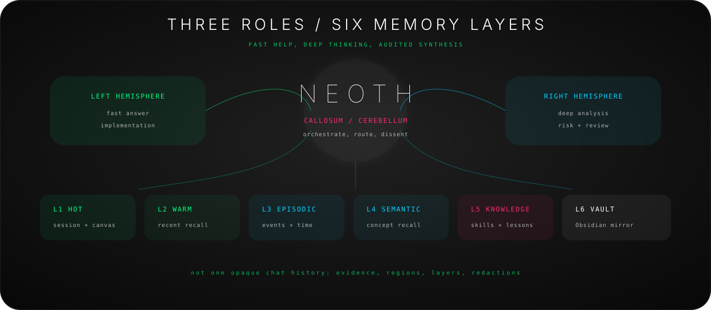

NEOTH uses role separation because a loyal assistant should not treat every task
as one giant prompt.

| System | Job |
| :-- | :-- |
| **Left path** | Fast, pragmatic help, routing, daily buddy work, small tasks. |
| **Right path** | Deeper reasoning, planning, alternatives, difficult code and architecture. |
| **Corpus callosum** | Arbitration, evidence collection, contradiction handling, consensus, escalation. |
| **Five memory tiers + vault** | Short recall, personal profile, ground truth anchors, consolidated facts, long-term knowledge — plus ingested external-vault context. |

The point is not mystical branding. The point is operational separation: fast
tasks stay fast, serious tasks get more scrutiny, and durable memory gets
evidence instead of vibes.

Each path binds to its own provider — Anthropic on the left, a local model on
the right, OpenRouter as arbiter, any mix you want — and hard questions go to
a **council**: the paths argue, dissent is recorded, and the runtime tracks
which path wins which kind of argument over time and reweights routing
accordingly.

```bash
neoth hemispheres set --role right --provider local_ouro
neoth council voices
neoth ecology winner-chain   # who has been winning the arguments, and why
```

Facts you never want the model to overwrite live in a separate register:
`neoth groundtruth add` pins them immutably, and NEOTH flags contradictions
across sessions for you to resolve instead of silently picking a side.

## Babel-Index: It Predicts Its Own Collapse

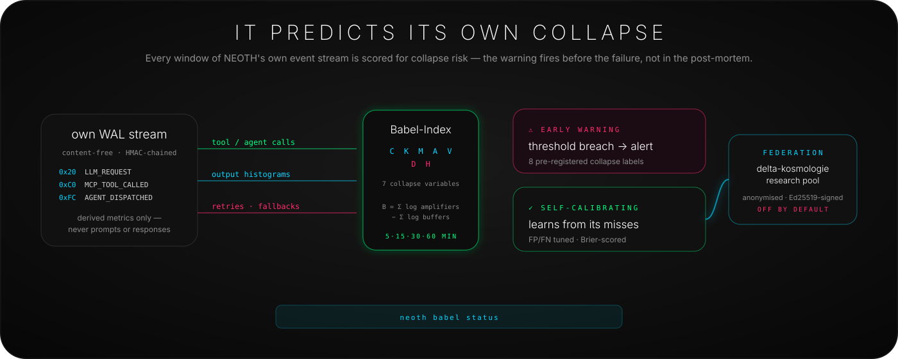

Agent systems fail in recognizable shapes — retry storms, agent loops,
context death spirals. Most frameworks let you find them in the post-mortem.
NEOTH watches its **own** WAL event stream, scores every rolling window with
seven collapse variables (coupling, convergence, pressure, agent density,
throughput vs. diversity and redundancy buffers), and warns you before the
failure. The failure definitions are deterministic and pre-registered; the
predictor self-calibrates against its own misses and reports a Brier score,
so the accuracy claim is measurable instead of asserted.

```bash
neoth babel status      # threshold, calibration, latest scores
neoth babel windows     # the actual measurements, window by window
```

`K_d` uses the content-free `K_d_v0` response histogram by default. Operators
can select a configured local embedding checkpoint with
`babel.k_d_embedding_model`; the central provider-completion boundary covers
streaming and non-streaming successes, while Incognito calls never enter the
feed. Optional `memory_signals` and `skill_signals` add versioned,
content-free posture counters for contradictions, true recall misses, and the
final skill-routing outcome. They are off by default and never silently
rewrite the seven score variables.

There is a bigger bet underneath: the collapse model comes from
[delta-kosmologie](https://github.com/The-Geek-Freaks/delta-kosmologie), an
open framework asking whether one scalar family predicts collapse across
complex systems in general. Opting in (**off by default**, consent- and
autonomy-gated) federates anonymised, Ed25519-signed, content-free window
records into the shared falsification pool — making NEOTH the first
production instrument of an open research program, with
[docs/babel-index.md](docs/babel-index.md) spelling out every rule.

## Shipped, Easy To Miss

Small commands that quietly carry a lot of the product. All of these work
today:

| Command | What you get |
| :-- | :-- |
| `neoth dream now` | Cluster recent episodes into themes, written to Obsidian as notes. |
| `neoth groundtruth ask "<q>"` | Query the immutable-facts register; contradictions get flagged, not overwritten. |
| `neoth identity merge` | The same person on Telegram, WhatsApp, and email becomes one identity. |
| `neoth recall-score` | LongMemEval-style memory benchmark with inter-rater kappa — prove recall quality. |
| `neoth memory-eval` | Reproducible recall benchmark in a temp DB; never touches real memory. |
| `neoth profile communication why directness` | Explain the typed, subject-bound evidence behind an active presentation preference without revealing raw messages. |
| `neoth cost "<prompt>"` | Token count and dollar estimate before the call is made. |
| `neoth lease grant codex code:write --ttl 30m` | Time-limited capability grant that auto-expires; WAL-logged. |
| `neoth recipe share` | Prompt template as a `neoth://recipe/…` deeplink anyone can run with their own parameters. |
| `neoth adr extract` | Architecture Decision Records extracted from your sessions as structured files. |
| `neoth okf export` | Your memory as an interlinked Obsidian knowledge graph. |
| `neoth kanban watch --follow` | Live terminal feed of task progress, streamed from WAL frames. |
| `neoth companion pair-phone` | QR-code phone pairing over Noise-XX P2P; no relay server. |

## Comparison

Different projects optimize for different jobs. NEOTH's bet is the harder
overlap: a DAU-friendly buddy, serious coding partner, local-first memory
system, private mesh, and inspectable operator runtime in one product.

Five things you will not find documented in any of the compared projects —
each with the command that proves it on your machine:

| Only in NEOTH | Prove it |
| :-- | :-- |
| Collapse prediction on its own runtime ([Babel-Index](docs/babel-index.md)) | `neoth babel status` |
| HMAC-chained audit log you can verify yourself | `neoth verify` |
| Evidence-linked profile memory behind explicit consent | `neoth profile pending` |
| WASM capability sandbox that refuses + audits over-level calls at runtime | `neoth plugin ledger` |
| Fail-closed trust boundaries as the default, not a setting | `neoth privacy audit --last 30d` |

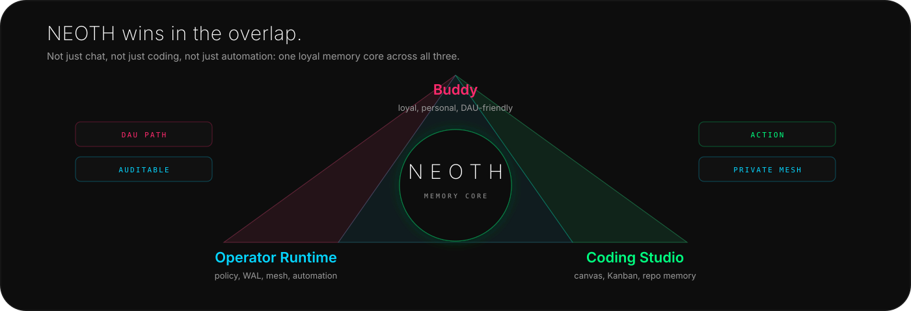

| Capability | NEOTH | OpenHuman | OpenClaw | Hermes Agent |
| :-- | :--: | :--: | :--: | :--: |
| GUI-first normal-user onboarding | **Yes** | Yes | Partial | Yes (desktop app) |
| CLI/operator path | **Yes** | Partial | Yes | Yes |
| Local-first memory as default product shape | **Yes** | Partial | Yes | Yes |
| Fail-closed profile extraction | **Yes** | Partial | Partial | Partial |
| Evidence-linked profile facts | **Yes** | Partial | Partial | Partial |
| WAL/audit trail for sensitive actions | **Yes** | Partial | Partial | Partial |
| Five-tier memory model + vault ingest | **Yes** | No | No | Partial |
| Three role-bound brain paths | **Yes** | No | Partial | Partial |
| Collapse prediction on its own runtime (Babel-Index) | **Yes** | No | No | No |
| Coding canvas + Kanban | **Yes** | Partial | Canvas-focused | Desktop cockpit + Kanban |
| Obsidian/vault workflow | **Yes** | Yes | File-based | Context-file based |
| Paperless/CalDAV as inputs; source-build IMAP triage | **Yes** | Integrations | Skills/tools | Tools/skills |
| n8n localhost automation | **Yes** | No | Partial | Cron/tools |
| WASM plugin capability sandbox | **Yes** | No | Skills | Skills/tools |
| Durable private mesh with Tailscale/Hysteria/peeroxide or Iroh carriers (NEOTH protocol; separate from Keet channels) | **Yes** | No | Gateway/nodes | Gateway/platforms |
| Built for DAUs and pros at the same time | **Goal** | DAU-heavy | Power-user-heavy | Operator-heavy |

Competitor columns were re-verified against upstream releases on **2026-07-03**
(Hermes v0.18.0, OpenClaw v2026.6.11, OpenHuman v0.58.7) — where a competitor
caught up, the table says so.

NEOTH is pre-1.0, so this table is honest about what is not finished. **Private mesh**
now has per-peer durable cursors, authenticated content-bound ACKs, byte-exact restart
replay, transactional receiver materialization, deterministic conflict records, and
canonical memory/ground-truth snapshots over peeroxide and optional Iroh carriers; see
[the durable sync contract](docs/mesh-sync.md). The **WASM plugin capability sandbox**
(V10-04) ships in the native desktop
release binaries and is exercised by tests, but it is **feature-gated** (`wasm-plugin-host`)
— source builds opt in, and only the headless static musl server archive omits it.
Native GNU Linux x64 and ARM64 desktop archives both include the GUI, Keet companion,
WASM host and other `release-desktop` capabilities. **Built for
DAUs and pros** is the explicit design **goal**, not a finished claim — it is the hard bet
NEOTH is making, and the single thing most worth holding it accountable to. Everything
marked **Yes** is implemented and exercised by tests; the live status of every line item is
in [PLAN/PROGRESS_v1_0.md](PLAN/PROGRESS_v1_0.md).

Native GNU Linux, macOS and Windows desktop releases include both Peeroxide and
Iroh; the static headless musl server includes Peeroxide only. Cluster settings
are submitted as one exact GUI/CLI transaction, including optional stdin-only
passphrase handling. Enabled carrier changes are not hot-switched today: the
receipt reports `restart_required: true`, and the supervised daemon must be
restarted before transport, mDNS or gossip behavior is considered active. A
disabled cluster with no running daemon is already inert and correctly reports
`restart_required: false`. A retry cannot erase a real pending state; `cluster
status` reports an active carrier only after the daemon acknowledges successful
startup for both the exact public snapshot and its owner-private identity
binding.

Read the detailed migration pages:

- [NEOTH vs OpenHuman](docs/compare/openhuman.md)
- [NEOTH vs OpenClaw](docs/compare/openclaw.md)
- [NEOTH vs Hermes Agent](docs/compare/hermes.md)

## Doctor

Setup errors should not feel like archaeology.

```bash
neoth doctor
neoth doctor --list-checks
neoth doctor --explain "channels wiring"
neoth doctor --explain "model caches"
neoth doctor --output json
```

`neoth doctor` checks config, credentials, profile database, WAL, HMAC key,
disk space, local model caches, channel wiring, Node-backed providers, tmux for
Claude CLI, plugin host state, provider flapping, usage caps, cluster registry,
and mDNS announcer behavior. Warn/fail output points to the exact `--explain`
runbook so beginners get plain fixes and pros get scriptable diagnostics.

## Docs

| Need | Doc |
| :-- | :-- |
| Start from zero | [docs/quickstart.md](docs/quickstart.md) |
| Install paths | [docs/install.md](docs/install.md) |
| Privacy proof | [docs/privacy.md](docs/privacy.md) |
| Verify the claims yourself | [docs/evaluation.md](docs/evaluation.md) |
| CLI reference | [docs/cli-reference.md](docs/cli-reference.md) |
| Channels | [docs/channels.md](docs/channels.md) |
| Local models | [docs/local-models.md](docs/local-models.md) |
| Providers | [docs/providers.md](docs/providers.md) |
| Plugins | [docs/plugins.md](docs/plugins.md) |
| Babel-Index / collapse prediction | [docs/babel-index.md](docs/babel-index.md) |
| Architecture | [docs/architecture.md](docs/architecture.md) |
| Release notes | [docs/release-notes-v1.0.md](docs/release-notes-v1.0.md) |
| Security policy | [SECURITY.md](SECURITY.md) |
| Contributing | [CONTRIBUTING.md](CONTRIBUTING.md) |

## Release Shape

NEOTH 1.0 is for one operator first: your machine, your memory, your private
tools, your approved network. It is not a hosted SaaS account, not a team
multi-tenant product, and not a black-box model router.

What works and what intentionally stays out of 1.0 is tracked in
[docs/release-notes-v1.0.md](docs/release-notes-v1.0.md).

## Contributing

Small, focused PRs are welcome. Read [CONTRIBUTING.md](CONTRIBUTING.md), run
the checks, and keep the product promise intact: simple for normal users,
serious for operators, loyal to the user.

## License

NEOTH is dual-licensed under MIT OR Apache-2.0, at your option — see
[LICENSE-MIT](LICENSE-MIT) and [LICENSE-APACHE](LICENSE-APACHE).
Third-party notices: [THIRD_PARTY_LICENSES](THIRD_PARTY_LICENSES).
