<!-- ════════════════════════════════════════════════════════════════════════════
     N E O T H  ·  v1.1  ·  Sovereign README
     "Neoth knows. Neoth helps. Neoth is your life."
     This README follows the NEOTH README Visual & Structural Manifesto v1.0.
     ════════════════════════════════════════════════════════════════════════════ -->

<div align="center">

<picture>
  <source media="(prefers-color-scheme: dark)"  srcset=".github/assets/hero-dark.svg">
  <source media="(prefers-color-scheme: light)" srcset=".github/assets/hero-light.svg">
  
</picture>

<br/><br/>

**Neoth knows.**

<br/>

[](https://github.com/The-Geek-Freaks/NEOTH/actions)
[](https://www.rust-lang.org)
[](LICENSE)
[](#-the-llm-council)
[](https://discord.gg/placeholder)

<br/>

</div>


<br/><br/>

<!-- ═══════════════════════════════════════════════════════════════════════════
                            ACT  ·  I  ·  THE SOVEREIGNTY
     ═══════════════════════════════════════════════════════════════════════════ -->

<div align="center">


<br/><br/>

> *"In Thoth's scales, only memory has weight."*

</div>

<br/><br/>

# The Sovereignty

NEOTH is a personal AI agent written in Rust. It connects to your chat channels (Telegram today; Keet, WhatsApp, Slack on deck), remembers everything you tell it via a tamper-evident write-ahead log, and routes your messages through a three-hemisphere LLM council — with profile extraction, image embedding, and speech transcription all running locally so your conversations stay on your machine.

Named after **Thoth**, Egyptian god of writing and memory. This thing does not forget.

<br/>

### Why NEOTH exists

Every AI assistant today has amnesia. Start a new session, start from scratch. NEOTH breaks that pattern.

The promise is not features. The promise is **continuity** — that the agent you spoke to last month remembers, and that the record is sovereign to you.

<br/>

### The Five Obligations

1. **Persistent memory.** WAL-based event store with HMAC-signed compaction markers. 4-tier memory (hot 7d / warm 90d / long-term Hebbian-filtered / immutable ground-truth) plus an `idx_embedding` vector store for cross-modal recall. Nothing gets lost.

2. **Local multimodal pipeline.** PDFs (`pdf-extract`), images (CLIP ViT-B/32 → 512-dim embeddings), audio (Whisper large-v3-turbo with auto language detection), video (ffmpeg audio track + Whisper). All inference is pure-Rust via `candle 0.8` — no Python, no ONNX runtime.

3. **Local profile extraction.** Qwen3-4B-INT4 runs on your hardware. Your conversation text never reaches a second cloud vendor for analysis.

4. **Three-hemisphere council.** Left generates your response. Right watches for patterns. Corpus Callosum surfaces disagreement. The council only fires when actually needed (~5–8% of turns), not on every keyword match.

5. **Operator-agnostic, single binary.** No hardcoded identity. `neothd` daemon + `neoth` CLI. No microservices. No Docker compose. The `neothd-gui` Slint wizard ships alongside for first-launch setup.

<br/>

### Current status — v0.1 (Sovereign Build)

The daemon is feature-complete for solo-operator use. Multimodal stack landed 2026-05.

**Channels:** Telegram (v0.1+ shipping), WhatsApp / Slack / Discord / Keet (v0.2+ adapter code, GUI wizard configures from Settings → Channels). Signal / Matrix / LINE / iMessage on the roadmap.

**Providers:** `claude-cli`, OpenAI, Gemini, OpenAI-compat. **Per-hemisphere binding** — Left (fast) + Right (deep) + Cerebellum (orchestrator) each pick a provider independently via `freedom.yaml::inference`.

**Coding workflow:** Hermes-adapted `neoth code "<prompt>" --dispatch` end-to-end. Cerebellum decomposes; heuristic + LLM-second-opinion classifier routes Fast→Left / Deep→Right / Ambiguous→escalate; `ProviderWorker` fires the bound provider; outcome stored in views.db kanban. **9-tab GUI Code Sessions board** (5-column kanban + click-to-detail pane + activity feed + live 2s tail + comment composer + assign-row + Promote-REVIEW button) covers the operator surface.

**Memory:** 4-tier Hebbian + `idx_embedding` vector store. Full multimodal extraction (`neoth ingest`), cross-modal recall (`neoth recall --similar-to <image>` / `--similar-to-text "<prompt>"`). Model cache (`neoth models pull clip|whisper`). Ground-truth fact store with Q&A wizard, bulk-text intake, ARP/nmap infra-scan, foreign-agent import (Hermes / OpenClaw / OpenHuman / Veronica).

**Plugins:** WASM plugin host with discovery (`~/.neoth/plugins/<id>/`), wasmtime compile pre-flight, ResourceLimiter-enforced 64 MiB memory cap, fuel-metered execution, hostcalls catalogue (4 functions). `HookAction::Plugin { plugin_id }` fires registered plugins from any of the 8 hook stages. Example plugin at `examples/wasm-plugin-hello/`.

**Security:** HMAC-signed WAL compaction markers + REDACTION_MARKER audit trail; secure-by-default MCP allowlist (compromised MCP server can't expose arbitrary new tools); webhook signature verification with anti-fragility fuzz tests; YAML-defined hooks with regex matchers across 8 lifecycle stages; autonomy levels (strict / standard / elevated / full / custom) gate every tool + provider call.

**Operator surface:** Slash commands `/help` `/recall` `/status` `/jobs` `/agent` `/code`. Sub-agents: code-reviewer, security-reviewer, planner. Architecture Decision Records auto-extraction. Hardware autodetect (CPU / RAM / CUDA / Metal / OpenVINO). 9-step GUI wizard (welcome → license → identity → provider → autonomy → channels → keys → done → settings) + post-onboarding chat surface. WCAG-AA contrast, keyboard-first mode selection (G/C/Enter shortcuts), sovereign-curve screen transitions. `neoth update --self` checks GitHub for newer releases.

**Quality:** **2400+ unit tests, `fmt` + `clippy -D warnings` clean, Windows MSVC + Linux + macOS green in CI.** Comprehensive 27-issue GUI audit closed (26 fixed + 1 polish deferred as documented).

**Open before v1.0:** Hysteria transport (R-3). Cluster mode (R-7). Cloud connectors (R-8). D14b Qwen Phase 2 forward-pass for fully-local inference. Pick #6 Phase 4 Q1 patch-safety actual apply (Chorus-gated). Live Discord WSS dial. See the [roadmap](#roadmap).

<br/><br/>


<br/><br/>

<!-- ═══════════════════════════════════════════════════════════════════════════
                              ACT  ·  II  ·  THE BUDDY
     ═══════════════════════════════════════════════════════════════════════════ -->

<div align="center">


</div>

<br/><br/>

# The Buddy

From install to first recall in five minutes. The MVP loop is short on purpose.

<br/>

### 60-Second Install

**Prerequisites:** Rust 1.86+ (MSRV enforced in CI). NEOTH is not yet on crates.io.

```bash
# Build from source. Windows MSVC, Linux, macOS all green in CI.
git clone https://github.com/<your-org>/neoth
cd neoth/SRC
cargo install --path neothd            # daemon + CLI
cargo install --path neothd-gui        # optional: Slint wizard GUI
```

The `neothd` binary lands in `~/.cargo/bin/`. `scripts/install.sh` additionally creates a `neoth` symlink → `neothd` so the documented `neoth <subcommand>` UX works without rebuilding; manual installs run `ln -sf neothd ~/.cargo/bin/neoth` once. On Windows MSVC, run the build inside a `vcvars64`-initialised shell so `link.exe` resolves (Git Bash's PATH shadows it).

Pre-built release binaries: see [Releases](../../releases) — Linux x86_64, aarch64, macOS arm64. Windows binaries are published; the wizard handles MSVC's DACL model via `icacls`.

<br/>

### Windows Development Setup

`ring` + `rusqlite` need MSVC `link.exe` on the build PATH. Git Bash's PATH shadows it, so a stock Windows terminal will fail with `error: could not exec the linker cl.exe`. Two options:

**Option A — auto-detect via the bundled cargo wrapper** (no env changes):

```powershell
# Runs cargo inside a vcvars64-initialised environment automatically.
.\scripts\cargo-msvc.ps1 build --workspace
.\scripts\cargo-msvc.ps1 test --workspace
.\scripts\cargo-msvc.ps1 clippy --workspace --tests -- -D warnings
```

**Option B — one-shot setup that writes a persistent wrapper:**

```powershell
# Verifies Rust + VS Build Tools install, writes C:\Temp\build-neoth.cmd
# so `cmd //c "C:\Temp\build-neoth.cmd test --bin neothd"` works from any shell.
.\scripts\setup-windows.ps1
```

Prerequisites either way:
- **Rust 1.86+** via [rustup](https://rustup.rs/) (`rustup target add x86_64-pc-windows-msvc` is automatic on Windows).
- **Visual Studio Build Tools 2022** with the "Desktop development with C++" workload — `winget install Microsoft.VisualStudio.2022.BuildTools --override "--add Microsoft.VisualStudio.Workload.VCTools"` works headlessly.
- **Windows 10 SDK** (bundled with the VC++ workload above) — supplies `kernel32.lib` + `ucrt.lib` that `ring` links against.

The shipped `C:\Temp\build-neoth.cmd` wrapper does the same vcvars + SDK probe `cargo-msvc.ps1` does, in cmd-script form so non-PowerShell tooling (Make, build agents, Claude Code on Windows) can invoke cargo without per-shell vcvars setup.

<br/>

### Five Steps to Hello NEOTH

<br/>

#### 1 · Initialize

```bash
neothd init               # TTY wizard (8 steps), or
neothd-gui                # Slint GUI wizard with hardware autodetect
```

Creates `~/.neoth/freedom.yaml` + (when secrets are entered) `~/.neoth/credentials.yaml` (mode `0600`). You'll be asked for:

- Operator id + autonomy level (strict / standard / elevated / full / custom)
- Provider (Claude API key, `claude` CLI OAuth, OpenAI, Gemini, local Qwen, …)
- Channels (CLI is always on; Telegram needs a [@BotFather](https://t.me/botfather) token)

<br/>

#### 2 · (optional) Pre-fetch the multimodal models

```bash
neothd models list
neothd models pull clip       # ~605 MiB → ~/.neoth/models/openai-clip-vit-base-patch32/
neothd models pull whisper    # ~1.6 GiB → ~/.neoth/models/openai-whisper-large-v3-turbo/
```

Without this step the first `neoth ingest` against an image or audio file blocks on the HF download. Run `neothd doctor` to see which caches are populated.

<br/>

#### 3 · Start the daemon

```bash
neothd serve
```

Reads `~/.neoth/freedom.yaml`, opens the WAL, awaits `SIGTERM` / `Ctrl+C`, drains cleanly on shutdown. PID written to `~/.neoth/neothd.pid` (single-instance lock). `NEOTH_LOG=debug neothd serve` for verbose tracing.

<br/>

#### 4 · Send it a message

Open Telegram. Find your bot. Send:

```
Hey, what do you know about me so far?
```

NEOTH echoes back, queries the WAL, assembles context, calls your Left-hemisphere LLM, and replies — all within the same Telegram thread.

<br/>

#### 5 · Recall — text or cross-modal

```bash
# Plain text recall across all four memory tiers.
neothd recall "what did I ask about yesterday"

# Multimodal: ingest a file, then find similar images.
neothd ingest ~/Pictures/sunset.jpg
neothd recall --similar-to ~/Pictures/another.jpg
neothd recall --similar-to-text "a photo of a sunset over the ocean"
```

`ingest` routes to the right extractor (PDF / image / audio / video), persists the CLIP embedding into `idx_embedding`, and prints a JSON or table report. Subsequent `recall --similar-to*` queries hit the persisted vector store via brute-force cosine.

<br/>

#### 6 · Check daemon status

```bash
neothd status
neothd doctor
```

`status` prints a one-shot snapshot of WAL bytes, tier counts (hot / warm / long-term / ground-truth / embeddings), channels, and autonomy level (no daemon required — pure read). `doctor` runs the operator health checks (freedom.yaml, credentials, db, wal, hmac, quota, model caches, …) and exits non-zero on any failure.

If you set `observability_listen: "127.0.0.1:43117"` in `freedom.yaml`, the running daemon also exposes the same data over HTTP at `/healthz` (JSON) and `/metrics` (Prometheus).

That's the MVP loop. From here, explore `~/.neoth/freedom.yaml` to configure what NEOTH knows and remembers about you. Full CLI surface: `neothd --help`. Phase-by-phase plan: [`PLAN/PROGRESS.md`](PLAN/PROGRESS.md).

<br/><br/>


<br/><br/>

<!-- ═══════════════════════════════════════════════════════════════════════════
                              ACT  ·  III  ·  THE ENGINE
     ═══════════════════════════════════════════════════════════════════════════ -->

<div align="center">


</div>

<br/><br/>

# The Engine

What sits under the surface. The Rust core, the WAL, the council, the regions.

<br/>

### Memory Architecture · Six Brain Regions, One WAL

<br/>

<div align="center">


</div>

<br/>

| Region | WAL View | Purpose |
| :--- | :--- | :--- |
| Hippocampus  | `idx_episode`    | Episodic recall, conversation history |
| Amygdala     | `idx_importance` | Emotional salience, priority signals |
| Insula       | `idx_council`    | Council debate logs |
| Cerebellum   | `idx_motor`      | Provider quota tracking, rate limits |
| Basal Ganglia| `idx_habit`      | Recurring patterns, habit signals |
| Hypothalamus | `idx_profile`    | Long-term operator profile state |

<br/>

### Daemon Topology

```
  You
   │  Telegram / WhatsApp / Slack
   ▼
┌──────────────────────────────────────────────────────┐
│                   NEOTH daemon (neothd)              │
│                                                      │
│  Channel Layer                                       │
│  ┌──────────┐  ┌───────────┐  ┌──────────┐           │
│  │ Telegram │  │ WhatsApp  │  │  Slack   │           │
│  └────┬─────┘  └─────┬─────┘  └────┬─────┘           │
│       └──────────────┴──────────────┘                │
│                       │                              │
│  WAL (Write-Ahead Log)                               │
│  ┌────────────────────────────────────────────────┐  │
│  │ 96-byte EventHeader · HLC timestamps           │  │
│  │ Segments: 256 MiB / 24h · HMAC-signed          │  │
│  │ 6 indexed views (episode/importance/council/…) │  │
│  └────────────────────────────────────────────────┘  │
│                       │                              │
│  Tool-Framework v4.1 "Pflegbarer Garten"             │
│  ┌───────────┐  ┌────────────┐  ┌──────────────┐     │
│  │   Tool    │  │  Pipeline  │  │   Ecology    │     │
│  │ (micro)   │  │  (meso)    │  │  (macro)     │     │
│  └───────────┘  └────────────┘  └──────────────┘     │
│                       │                              │
│  LLM Topology                                        │
│  ┌──────────────────────────────────────────────┐    │
│  │ Left Hemisphere  → Claude Opus 4.7           │    │
│  │   sole user-output channel                   │    │
│  │ Right Hemisphere → Gemini (Phase 2)          │    │
│  │   pattern analysis · no user egress          │    │
│  │ Corpus Callosum  → Codex (Phase 2)           │    │
│  │   synthesis · dissent surfacing              │    │
│  │ Local Extraction → Qwen3-4B-INT4 (Phase 2)   │    │
│  │   profile extraction · stays on machine      │    │
│  └──────────────────────────────────────────────┘    │
└──────────────────────────────────────────────────────┘
```

<br/>

**Three-layer framework (Tool / Pipeline / Ecology):**

- **Tool (Schicht 0):** Stateless micro-operations. No self-modification, no goal-seeking.
- **Pipeline (Schicht 1):** Declarative YAML orchestration. Budget-aware. Degrade gracefully.
- **Ecology (Schicht 2):** Read-only observer. Scans health, emits reports, never writes.

13 anti-patterns from Framework v4.1 are enforced as compile-time and runtime tests: stateful tools, self-modifying tools, goal-seeking tools, meta-decision-making, emergent composition, refusal bypass, scope inflation, strong emergence, black-box tools, magic scale assumptions, closed-loop ecology, level confusion, Bateson-III claims.

<br/>

### The LLM Council

| Provider | Auth Mode | Left | Right | Callosum | Local |
| :--- | :--- | :-: | :-: | :-: | :-: |
| Claude (Anthropic)  | API key or `claude` CLI OAuth | ✓ | — | — | — |
| Gemini (Google)     | API key or `gemini` CLI OAuth | — | ✓ | — | — |
| Codex (OpenAI)      | API key or `codex` CLI OAuth  | — | — | ✓ | — |
| Qwen3-4B-INT4       | Local (`candle`, your GPU)    | — | — | — | ✓ |

**Phase 1 (Day 1–30):** Only Left hemisphere is active. Pick Claude API key or `claude` CLI.

**CLI OAuth vs API keys:** NEOTH supports both. CLI OAuth uses your existing Claude / Gemini / Codex installs and their quota. API keys give explicit rate control. Configure per-provider in `~/.neoth/freedom.yaml`:

```yaml
providers:
  left:
    model: claude-opus-4-7
    auth: cli_oauth          # or: api_key (set ANTHROPIC_API_KEY env var)
  right:
    model: gemini-3-1-pro
    auth: api_key            # set GEMINI_API_KEY env var
  callosum:
    model: gpt-5-5
    auth: cli_oauth
```

**Council daily budget** (prevents quota exhaustion on "security" keywords appearing constantly):

```toml
# ~/.neoth/council.toml
[council.budget]
max_debates_per_day = 5
max_usd_per_day     = 2.00
```

<br/>

### Feature Roadmap

| Feature | Phase | Status |
| :--- | :--- | :--- |
| Telegram channel | 1 | Day 30 target |
| WAL-based persistent memory | 1 | Day 30 target |
| Left-hemisphere LLM response (Claude) | 1 | Day 30 target |
| Recall: episode + keyword search | 1 | Day 30 target |
| Local profile extraction (Qwen3-4B-INT4) | 2 | Day 38–42 |
| Right hemisphere (Gemini pattern analysis) | 2 | Day 31–37 |
| Corpus Callosum synthesis + dissent | 2 | Day 43–49 |
| WhatsApp channel | 2 | Day 31–37 |
| Slack channel | 2 | Day 31–37 |
| Council governance (smart trigger) | 2 | Day 43–49 |
| Mirror-refusal pipeline | 2 | Day 56–60 |
| WASM plugin host | 2 | Day 56–60 |
| `neoth privacy audit` CLI | 2 | Day 42 |
| Drift detection (profile baseline) | 4 | Day 91+ |

<br/>

### Configuration

Three config entry points, all in `~/.neoth/`.

<br/>

#### `freedom.yaml` — what NEOTH knows and what it can say

```yaml
operator:
  name: ""                       # fill in your name or leave blank
  timezone: "Europe/Berlin"

profile:
  learn:
    health: false                # never store health claims locally
    location: true

inference:
  allow_cloud_fallback: false    # LOCAL ONLY for profile extraction (default)
  local_model: qwen3-4b-int4

channels:
  telegram:
    enabled: true
    token_env: TELEGRAM_BOT_TOKEN
```

<br/>

#### `policy.yaml` — hard constraints the agent cannot override

```yaml
# Refusal and safety policy
refusal:
  mirror_loop_guard: true        # prevent mirror-refusal feedback loops
  exclude_from_profile_learn:
    - REFUSAL_OBSERVED
    - REFUSAL_MIRRORED

# WAL retention
wal:
  max_segment_size_mib: 256
  max_age_hours: 24
  disk_pressure_level: 3         # 1-5, triggers compaction at 3
```

<br/>

#### `skills/` — WASM plugins (Phase 2)

Drop a `.wasm` file into `~/.neoth/skills/`. NEOTH validates the WASM interface, grants declared permissions via `PermissionToken<T>`, and hot-loads.

<br/>

### Privacy

**Profile extraction is LOCAL by default.**

`freedom.yaml` sets `inference.allow_cloud_fallback: false`. Qwen3-4B-INT4 runs on your hardware. Your conversation text is processed by:

- Your Left-hemisphere provider (Anthropic, for generating your response) — **one** cloud vendor.
- Local Qwen3-4B for profile extraction — **zero** additional cloud vendors.

Compare to v1.0 design (before this was fixed): profile extraction sent conversation windows to Google Gemini on every message. That was privacy theater. NEOTH v1.1+ eliminates it.

**What NEOTH stores:**

- WAL events with HLC timestamps
- Profile claims with evidence attribution (only from user's own speech — injected / quoted content is filtered)
- Council debate logs in `idx_council`

**`neoth privacy audit`** (Phase 2, Day 42): lists every profile claim, its evidence source, and lets you tombstone or redact. Redacted claims go into `idx_profile_redactions` with `never_recreate: true` — they don't come back.

<br/><br/>


<br/><br/>

<!-- ═══════════════════════════════════════════════════════════════════════════
                               APPENDIX  ·  THE OPERATOR
     ═══════════════════════════════════════════════════════════════════════════ -->

### Roadmap

NEOTH ships in four phases.

| Phase | Days | Milestone |
| :--- | :--- | :--- |
| 1 — MVP          | 1–30  | Telegram + WAL recall + Left-LLM response |
| 2 — Full Brain   | 31–60 | Qwen local, Right + Callosum, WhatsApp, Slack, Council, WASM |
| 3 — Evaluation   | 61–90 | 4-grader parity eval, operator anchor, 2FA cutover |
| 4 — Drift        | 91+   | Profile drift detection, adaptive council thresholds |

Detailed plan: [`PLAN/00_DESIGN_v1.1_FINAL.md`](PLAN/00_DESIGN_v1.1_FINAL.md).

<br/>

### Compared to Alternatives

Honest comparison. NEOTH is early-stage. These are established projects.

|                  | NEOTH                          | Letta (MemGPT)              | Mem0          | openclaw         |
| :---             | :---                           | :---                        | :---          | :---             |
| Language         | Rust                           | Python                      | Python        | varies           |
| Memory model     | WAL + 6 indexed views          | ArchivalMemory + InContext  | vector store  | depends on fork  |
| Local inference  | Qwen3-4B (Phase 2)             | optional                    | optional      | no               |
| Profile privacy  | local-only extraction          | cloud by default            | cloud         | no profile       |
| Multi-LLM council| 3-hemisphere (Phase 2)         | no                          | no            | no               |
| Channels         | Telegram, WhatsApp, Slack      | API only                    | API only      | Telegram, WhatsApp |
| Single binary    | yes                            | no (server + client)        | no            | no               |
| WASM plugins     | Phase 2                        | no                          | no            | no               |
| Maturity         | alpha / Day-1 build            | production                  | production    | varies           |
| Install          | `cargo install neoth`          | `pip install letta`         | `pip install mem0ai` | self-hosted |

**When to pick something else:**

- You need production-ready memory today → use Letta or Mem0.
- You need a hosted solution without running your own server → Mem0 cloud.
- You want to build on a working foundation and extend it → NEOTH, once Phase 1 ships.

<br/>

### Documentation

```
docs/
  architecture.md   — deep-dive: WAL, 6 regions, HLC
  providers.md      — LLM provider setup (API keys, CLI OAuth, local)
  channels.md       — Telegram, WhatsApp, Slack setup
  plugins.md        — WASM plugin authoring
  privacy.md        — what data goes where, audit tooling
  council.md        — 3-hemisphere topology, governance, budget
  ops.md            — deployment, backup, upgrading

PLAN/               — architecture decision records + specs
  00_DESIGN_v1.1_FINAL.md
  tool_framework_v4_1.md
  SPEC_*.md         — individual component specs
```

<br/>

### Contributing

See [CONTRIBUTING.md](CONTRIBUTING.md). Short version: Rust 1.86+, `cargo test` must pass, 80% coverage on new code, conventional commits, PR against `main`.

### Community

- Discord: [placeholder link]
- Issues: [GitHub Issues](https://github.com/The-Geek-Freaks/NEOTH/issues) — tag `good first issue` for onboarding

### Code of Conduct

[CODE_OF_CONDUCT.md](CODE_OF_CONDUCT.md)

### Security

Report vulnerabilities privately. See [SECURITY.md](SECURITY.md).

### License

Licensed under either of:

- MIT license ([LICENSE-MIT](LICENSE-MIT) or https://opensource.org/licenses/MIT)
- Apache License, Version 2.0 ([LICENSE-APACHE](LICENSE-APACHE) or https://www.apache.org/licenses/LICENSE-2.0)

at your option.

<br/><br/>


<br/>

<div align="center">

*Neoth knows. Neoth helps. Neoth is your life.*

<br/>

<sub>**N** · 01 · v1.1 · Sovereign Build · 2026</sub>

</div>

<br/>
